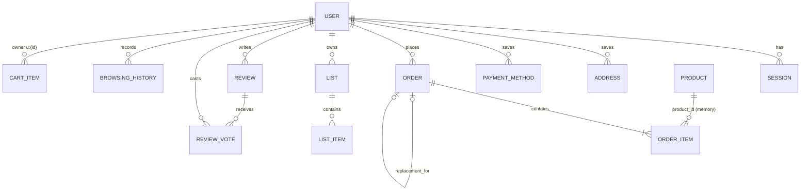

# nile product map (Amazon.com rebuild spec)

Coding agents build straight from this file. Read it with `docs/build-guide.md` (repo rules, existing helpers) and `docs/next16-notes.md` (Next 16 APIs). Last reconciled with the working tree on 2026-09-14: commit `1e85259` plus the uncommitted account, lists, history and orders work.

**How to read it**
- **Tier**: **P0** means the loop can't work without it. **P1** comes after P0 works on the deployed URL. **P2** only if time remains. **Out** means we're not building it (§7.4).
- **Status**: **[exists]** is built and matches, so reuse it. **[change]** is built but needs an edit. **[new]** isn't built yet.
- **Source precedence** when facts conflicted: 1) verified sources, meaning `docs/recon/browser-pass.md` and its screenshots, Amazon's live CSS tokens, `data/products.json`, and the repo's code; 2) the critic's gap fills; 3) memory. If a critic suggestion contradicts something the repo already shipped, the shipped version wins. The exception is a shipped behavior with a correctness, security or honesty problem, which becomes a [change]. Unverified claims that still matter are listed in §8.
- Quoted strings are exact UI copy. Wherever Amazon names itself, write **nile**.
- Money is integer cents in the DB and in order math. Catalog prices are dollars (`Product.price`); convert them with `toCents`.

---

## 0. Locked decisions (don't reopen)

| Topic | Decision | Status |
|---|---|---|
| Brand | **nile**, text wordmark `<Logo>`. Never use Amazon's logo, smile, name, "Prime" or imagery. The Amazon's Choice badge becomes **nile's Choice**. Footer disclaimer: "nile is a working rebuild of Amazon.com, built for the 8x assignment. It is not affiliated with Amazon. Orders, payments and deliveries are simulated; nothing is charged or shipped." | [exists] |
| Indexing | `robots: { index: false, follow: false }` in the root `metadata`, plus `app/robots.ts` returning `Disallow: /`. A public Amazon look-alike must never get indexed or flagged as phishing. | **[new] P0** |
| Stack | Next.js 16.3.5 App Router, React 19.2, TypeScript, Tailwind 4 (`@theme` in `app/globals.css`), Vercel | [exists] |
| Database | Postgres. Neon over HTTP when `DATABASE_URL` is set; in-process PGlite at `.data/` locally. `query`/`one` from `lib/db.ts`. **No interactive transactions**: an atomic multi-row write is one SQL statement using CTEs. Schema changes are appended to `db/schema.sql` as `if not exists` statements. | [exists] |
| Catalog | `data/products.json` (DummyJSON) held in memory by `lib/catalog.ts`. Search, facets and sorting run in JS. Product id is the DummyJSON integer. **Price and stock are static**: never written or decremented. | [exists] |
| Auth | Email + password, scrypt hashes. A random 32-byte session token stored as sha256, httpOnly cookie `session` (30 days). Guest cart cookie `guest` (90 days). Redirect parameter **`return_to`**, same-origin only (`safeReturnTo`). One unified email-first form. | [exists]; minimum password length 6 → **8** is **[change] P0** |
| Mutations | Server Actions only. Each one re-checks `getUser()`, scopes SQL with `where user_id = $1`, recomputes money on the server, then calls `refresh()` or `redirect()`. The only route handler is `GET /api/suggest`. | [exists] |
| Gating | Pages call `requireUser(path)`, which redirects to `/ap/signin?return_to=…`. No `proxy.ts`. | [exists] |
| Payments | Simulated. The server accepts **only the test cards in §4.17**. Store brand, last4, expiry and name only; never store or log the PAN or CVV. Cards ending 0002 are declined at place-order. | [exists]; test-card allowlist is **[change] P0** |
| Images | Plain `` from `cdn.dummyjson.com` with `object-contain mix-blend-multiply` on a `#f7f7f7` tile. No `next/image` optimization, because of the Hobby transformation quota. | [exists] |
| Email | None: no OTP, no order emails, no password-reset emails. Copy never promises an email. | [exists] |
| Prime | Removed everywhere. Every shopper gets the same delivery rules. | [exists] |
| Location | Header "Deliver to" shows the default address when signed in (links to the address book). Signed out it opens a "Choose your location" dialog: sign in, or enter a ZIP (saved in the `zip` cookie, shown as "Delivering to {ZIP}"). **Delivery dates don't depend on ZIP** (one simulated warehouse). | [exists] |
| Delivery math | One function, `deliveryPromise(product, now)` in `lib/delivery.ts`, used by cards, carousels, the PDP, cart, the checkout quote and orders (§4.4); checked by `lib/delivery.check.ts` | [exists] |
| Tax | A flat **8.25%** estimate on items + shipping, labelled as an estimate | [exists] |
| Demo controls | Dashed "Demo:" buttons on order pages fast-forward delivery and return receipt (§4.9). Always on, since this is a demo store. | **[new] P0** |
| Routes | Keep the shipped routes: `/ap/signin`, `/thankyou/[orderId]`, `/review/create/[id]`, `/checkout?buy=`. Don't rename them. | [exists] |

**Critic suggestions we rejected, because the repo already chose differently**
- **Drizzle and interactive transactions**: single CTE statements are already atomic.
- **A `next` parameter and an `aid` anonymous cookie**: `return_to` and `guest` already ship. Guest browsing history isn't worth a second identity.
- **`proxy.ts` gating**: the Next docs call proxy an optimistic check only.
- **Per-ZIP transit days, a 2 PM local cutoff and a per-state tax table**: no ZIP-driven UI exists to show them, and flat, clearly labelled estimates are honest.
- **Copying images into `/public`**: the CDN works and the repo stays small.
- **Synthetic color and size variants**: DummyJSON has none, and fakes would reuse the same photos.
- **Recurring deal windows with countdowns**: we label deals "Deal" instead (§4.2).
- **A stored `rating_hist` column**: the histogram is derived deterministically (§4.12).

### 0.1 Catalog facts (computed from `lib/catalog.ts`, 2026-09-14)

- **Size**: 194 products in 24 categories. **[change] P0**: drop `vehicle` (5) and `motorcycle` (5) from `products`, and the `automotive` department from `DEPARTMENTS`. That leaves **184 products, 22 categories, 7 departments**; update `catalog.check.ts` to expect 184. Car prices and parcel delivery don't mix.
- **Prices**: $0.79–$15,999.99. **101 of 184 cost under $35**, so free-shipping progress shows on most small carts.
- **Discounts**: `listPrice` exists when the rounded discount is ≥5 (150 of 184). A "Deal" means a discount of at least 10% (107 products, 104 in stock).
- **Stock**: 0 for 3 products, 1–9 for 21 (12 of them 1–5), 10–20 for 15. Out-of-stock and low-stock states can be demoed without faking.
- **Brand**: missing on 92 products (all groceries, kitchen, sports, home décor, tops, dresses, jewelry). For these, hide the brand line, "Visit the … Store", and the Brands facet entry.
- **Ship days** from `shippingInformation`:

  | Value | Products | Ship days |
  |---|---|---|
  | "Ships overnight" | 39 | 1 |
  | "Ships in 1-2 business days" | 34 | 2 |
  | "Ships in 3-5 business days" | 23 | 5 |
  | "Ships in 1 week" | 32 | 5 |
  | "Ships in 2 weeks" | 28 | 10 |
  | "Ships in 1 month" | 28 | 20 |

  56 products therefore arrive in two weeks or more. That's faithful to the data; keep it.
- **Returns** from `returnPolicy`: "No return policy" 43, 7 days 48, 30 days 27, 60 days 33, 90 days 33. This is the return window (§4.11).
- **Warranty**: `warrantyInformation` has 10 values, from "No warranty" to "Lifetime warranty". Shown on the PDP.
- **Reviews**: exactly 3 per product, one-line comments, ratings skewed 4–5.
- **Synthetic signals** (deterministic): `ratingCount` 41–23,749. `boughtPastMonth` > 0 on 108 products. One Best Seller and one nile's Choice per category (22 each).
- **Ignored fields**: `minimumOrderQuantity` (buying one mascara must work) and `availabilityStatus` (we derive it from stock). No variants exist.

---

## 1. The product in one page

**Who shops**

| Shopper | Arrives with | Needs |
|---|---|---|
| Knows what they want | A query ("iphone", "mascara") | Search that finds it instantly, and a card with price, rating and delivery date so they can add to cart without opening the PDP |
| Browsing for a need | A department or "deals" | Department menu, Best Sellers, Today's Deals, filters that narrow in one click |
| Comparing | 2–5 PDPs | Price with % saved, rating distribution, reviews, an exact delivery date, the return window |
| Returning buyer | An order | Order status at a glance, Buy it again, cancel before shipping, return after delivery, a review |
| **Judge** (our real user) | A cold link, often signed out, sometimes on a phone | The loop works signed out, sign-up takes under 20 seconds, nothing is broken or fake-looking, speed is felt |

**Core loop (must work end to end on the deployed URL)**

`Home or Search → Results (filter/sort) → PDP → Add to cart (stay on page) → Cart → Proceed to checkout → Sign in or create account (cart kept) → Checkout (address, test card, delivery speed) → Place your order → Thank-you → Your Orders → Order details → Demo: deliver now → Return an item / Write a review → Buy it again`

**What makes Amazon efficient, and we copy it**
1. **One search box on every page**, with a department scope and autocomplete. Search is the main navigation.
2. **Decision-complete result cards**: price with superscript cents, list price struck through, stars and count, "bought in past month", a concrete delivery date, a stock warning, and Add to cart on the card.
3. **A concrete date, not a speed**: "FREE delivery **Wed, Sep 16**", never "3–5 days".
4. **Adding to cart never navigates.** The header count updates in the same response.
5. **Auth waits until checkout.** The guest cart survives sign-in, and `return_to` puts the shopper back where they were.
6. **Defaults make checkout one click.** Sections collapse to "Delivering to … Change" and "Paying with … Change"; "Place your order" sits in a sticky summary.
7. **Post-purchase self-service next to the order**: track, cancel, return, review, buy again. No customer service needed.
8. **A stable visual grammar**: yellow = primary action, orange = Buy Now, teal = link, red = urgency or deal, green = in stock or success. Dense 13–14px type, white boxes with `#d5d9d9` borders.

**What we deliberately do better (§7.5)**: no ads or sponsored rows, a shorter home page, applied-filter chips, exact result counts, one badge per card, undo on destructive actions, keyboard-operable menus, an explicit "Returnable until" date, one primary action per order state, readable reviews without signing in.

**Bar for "works"** (checked on the deployed URL, §7.1 slice 10)
- A signed-out visitor can go home → search "phone" → add to cart from results in under 30 seconds, and the count updates without a reload.
- A new visitor can go cart → Proceed to checkout → create account → address → test card → Place your order in under 2 minutes, with the cart intact.
- On Your Orders, "Demo: deliver now" → return an item → write a review takes under 1 minute.
- No visible link 404s. Every page works at 390px wide and with the keyboard.

---

## 2. Surfaces and screens

### 2.0 Route map (canonical; don't invent others)

| Route | Screen | Tier | Status | Auth |
|---|---|---|---|---|
| `/` | Home | P0 | [exists] | open |
| `/s?k&i&brand&min&max&rating&deals&instock&sort&page&nfpr` | Search and browse results | P0 | [exists] | open |
| `/dp/[id]` | Product detail (PDP) | P0 | [exists] | open |
| `/cart` | Shopping Cart | P0 | [exists] | open (guest cart) |
| `/ap/signin?return_to` · `/ap/register?return_to` | Sign in / create account | P0 | [exists] | open; a signed-in visitor is redirected to `return_to` |
| `/checkout` · `/checkout?buy=[id]&qty=N` | Checkout (cart lines or Buy Now) | P0 | [exists] | required |
| `/thankyou/[orderId]` | Order placed | P0 | [exists] | required, owner only |
| `/orders?tab=all\|open\|cancelled&q&page` | Your Orders | P0 (tabs and search P1) | **[new]** | required |
| `/orders/[orderId]` | Order Details + demo controls (+ cancel dialog, P1) | P0 | **[new]** | required, owner only |
| `/orders/[orderId]/track` | Track package | P1 | **[new]** | required, owner only |
| `/orders/[orderId]/return?item=[productId]` | Return items | P1 | **[new]** | required, owner only |
| `/account` | Your Account hub | P0 (minimal) | [exists] | required |
| `/account/addresses` · `/new` · `/[id]/edit` | Address book | P1 | [exists] | required |
| `/account/payments` | Wallet | P1 | [exists] | required |
| `/account/security` | Login & security | P2 | [exists] | required |
| `/lists` · `/lists/[listId]` | Your Lists | P1 | [exists] | required |
| `/history` | Your Browsing History | P1 | [exists] | required |
| `/bestsellers` · `/bestsellers/[slug]` | Best Sellers (slug = department or category) | P1 | [exists] | open |
| `/deals?i=` | Today's Deals | P1 | [exists] | open |
| `/product-reviews/[id]` | All reviews (star filter, sort, paging) | P1 | [exists] | open |
| `/review/create/[id]` | Create or edit a review | P1 | [exists] | required |
| `/api/suggest?q=` | Autocomplete JSON | P1 | [exists] | open |
| `/help` · `/conditions` · `/privacy` | Static pages | P1 | **[new]** | open |
| `app/not-found.tsx` · `app/error.tsx` · `app/global-error.tsx` | 404 and error pages | P0 | **[new]** (only segment-level ones exist) | open |

**Param rules for every list page**
- `page` below 1 becomes 1; above the last page it becomes the last page.
- If `min > max`, swap them.
- An unknown `sort` becomes `featured`; an unknown `i` is dropped.
- A non-numeric or unknown `/dp/[id]` returns 404.
- Another user's order, list or review returns the **same 404** as a missing one (no existence leak).

**Page sizes**: search 24, orders 10, reviews 10, best sellers 30.

**Conventions for every screen**
- **Server Components by default.** Every `searchParams`, `params` and `cookies()` read is awaited.
- **Loading**: only routes with slow or uncached reads get a `loading.tsx` skeleton: `/s` [exists], `/orders` [new]. Skeleton boxes use `#f0f2f2` and the same geometry as the real content. No shimmer under `prefers-reduced-motion`.
- **Errors**:
  - An expected error is a returned action state, rendered inline with `role="alert"`.
  - An unexpected error goes to `error.tsx` with `retry()`.
  - A failed optimistic action reverts and shows "Something went wrong. Please try again."
- **Signed out on a gated page**: `requireUser` redirects before rendering. A signed-out user who submits a gated action is redirected to sign-in with `return_to` set to the current page.

---

### 2.1 Global header — P0 [exists]

`components/header.tsx`, rendered by `app/(shop)/layout.tsx`. Checkout and auth use their own minimal layouts.

**Desktop (≥768px) row 1**: `bg-nav #131921`, 60px tall. Left to right:
1. ☰ icon (mobile only), then the `nile` logo → `/`. Every item uses `.nav-item`: 1px white outline on hover or focus, 2px radius.
2. Pin icon + two lines (lg+ only), linking to `/account/addresses` (signed out: `/ap/signin?return_to=/account/addresses`):

   | Situation | Line 1 (12px `#ccc`) | Line 2 (14px bold) |
   |---|---|---|
   | Signed in, has an address | "Deliver to {FirstName}" | "{City} {ZIP}" |
   | Signed out, ZIP chosen in the location dialog | "Delivering to" | "{ZIP}" |
   | Signed out, Vercel IP headers present | "Delivering to" | "{City} {ZIP}" |
   | No headers (local dev) | "Deliver to" | "United States" |

   Line 2 truncates at 150px. Signed out, the pin opens the "Choose your location" dialog instead of a link.

3. Search (`flex-1`): department `<select>` (grey `#e6e6e6`; label "All" or the department name; options "All Departments" + 7 departments), input with placeholder "Search nile", 44px `#febd69` button with a magnifier and `aria-label="Go"`. Focusing the input puts a 3px `#ff9900` ring around the whole bar.
4. Account: "Hello, sign in" or "Hello, {FirstName}" (12px) over "**Account & Lists** ▾" (14px bold) → the menu in §2.2.
5. "Returns" over "**& Orders**" → `/orders`.
6. Cart icon with the count centered over the basket (bold, brand orange; above 99 shows "99+"), then "**Cart**". `aria-label="Cart, 3 items"`.

**Row 2**: `bg-nav-light #232f3e`, 39px, scrolls horizontally instead of wrapping. "☰ **All**" (opens the drawer, §2.3) · "Today's Deals" · "Best Sellers" · "New Releases" (→ `/s?sort=newest`) · the department names. **[change] P0**: drop "Automotive".

**Mobile (<768px)**
- Row 1: ☰, logo, spacer, "Sign in ›" or "{FirstName} ›" (→ sign-in or `/account`), cart with count.
- Row 2: full-width search, 44px tall, no department select.
- Row 3: the shortcuts strip.
- Row 4 (`bg-nav-lighter #37475a`): pin + "{line 1} {line 2}".

**States**

| State | Behaviour |
|---|---|
| Signed out | "Hello, sign in"; cart shows the guest count, or 0 when there's no `guest` cookie |
| Cart changes | Every cart action calls `refresh()`, so the count re-renders in the same response. No client cart state |
| Suggest call fails | No dropdown; submit still works |
| Empty submit | With "All", nothing happens. With a department, go to `/s?i={dept}` |

**Changes**
- **[new] P0**: add a "Skip to main content" link as the first focusable element, targeting `<main id="main">`.
- **[change] P1**: make the menu trigger a `<button aria-expanded>`. It toggles on click or tap, closes on Esc or an outside click, and returns focus to the trigger.
- **[change] P1**: "Sign in" and "New customer? **Start here.**" carry `return_to={current path}`; "Start here." goes to `/ap/register`. Layouts can't read the path, so render these two links in a tiny client component that uses `usePathname()`.
- **P2**: make the mobile search row `sticky top-0 z-40`.

### 2.2 Account & Lists menu — P0 [exists], behaviour change P1

- White panel, 440px, right-aligned under the trigger, shadow `0 2px 12px rgba(0,0,0,.35)`. Opens on hover and on keyboard focus-within.
- **Signed out**, top block centered: yellow "Sign in" (224px), then "New customer? **Start here.**"
- Two columns:
  - **Your Lists**: "Shopping List", "Create a List" (→ `/lists?create=1`).
  - **Your Account**: "Account", "Orders", "Browsing History", "Addresses", plus "Sign Out" (signed in only; a POST action that lands on `/`).
- Mobile has no menu (see §2.1).
- Out: household profiles, Switch Accounts, Watchlist, Kindle, Music and every other link without a destination.

### 2.3 "All" departments drawer — P1 [exists]

- Left sheet `min(365px, 85vw)` over a `bg-black/75` overlay. A white close X sits outside the sheet. Esc closes it, body scroll locks, and focus moves to the close button. **[change] P1**: return focus to the "All" button on close.
- Contents in order: navy header "Hello, sign in" / "Hello, {Name}" → **Trending** (Best Sellers, Today's Deals, New Releases) → **Shop by Department** (7 accordions, each with "All {Dept}" plus its categories → `/s?i={slug}`) → **Help & Settings** (Your Account, Your Orders, Your Lists, Sign in / Sign Out).
- Better than Amazon: departments come first (Amazon leads with its own digital services) and expand inline instead of in sliding panels.

### 2.4 Search autocomplete — P1 [exists]

- `GET /api/suggest?q=` with `q` capped at 100 characters. 120ms debounce; the previous request is aborted.
- Dropdown flush under the input:
  - up to 8 **term** rows: magnifier, typed prefix in normal weight, completion in **bold** [V: browser pass]
  - a divider
  - up to 4 **product** rows: 40px thumbnail, one-line title, price
- Clicking a term searches; clicking a product opens its PDP.
- Keyboard: ↑/↓ moves the highlight via `aria-activedescendant`; Enter picks the highlighted row or submits the typed text; Esc closes. ARIA combobox and listbox roles.
- **[change] P1**: respond with `Cache-Control: public, s-maxage=3600, stale-while-revalidate=86400`. The catalog is static.
- **[change] P2**: pass the selected department as `&i=` and restrict matches to it.
- **Out**: recent searches with "Remove", AI question prompts, "in {Department}" scope rows (the live Amazon suggestion API returns none [V]).

### 2.5 Footer — P0 [exists]

- "Back to top" bar (`#37475a`, hover `#485769`).
- Three link columns on `#232f3e`:
  - **Shop**: Today's Deals, Best Sellers, New Releases, All departments
  - **Your Account**: Your Account, Your Orders, Your Lists, Browsing History
  - **Let Us Help You**: Your Addresses, Returns & Replacements, Shopping Cart
- `#131921` band with the logo and the disclaimer (§0).
- **[change] P1**: add "Help", "Conditions of Use" and "Privacy Notice" links to the static pages (§2.24).
- **Out**: the sister-brand grid, language and currency.

---

### 2.6 Home `/` — P0 [exists]

**Purpose**: a browse hub where every block is one click from search results, deals or a PDP. It stays short: about 10 blocks, not Amazon's 15+.

**Desktop layout** (`bg-page`, content max-width 1500px), top to bottom:
1. **Hero carousel** [exists]: 600px tall on lg, 280px on sm, 220px on mobile. Four slides, each with a kicker, title, blurb, yellow CTA and 3 product thumbnails:

   | Slide | CTA → destination |
   |---|---|
   | "Today's Deals" ("Up to {max}% off top picks") | `/deals` |
   | "Upgrade your tech" | `/bestsellers/electronics` |
   | "Make home your favorite place" | `/s?i=home-kitchen` |
   | "Fresh looks for the new season" | `/s?i=womens-fashion` |

   Behaviour: auto-advances; pauses on hover and focus; has a pause/play button, dots and swipe; never autoplays under `prefers-reduced-motion`. Prev/next buttons are labelled "Previous slide" / "Next slide".
2. **Card row** overlapping the hero by 330px on lg. Grid: 4 columns ≥1280, 3 ≥1024, 2 ≥640, 20px gap. White cards, 20px padding, title 21px bold, link at the bottom 13px `.link`. Cards in order:
   - Quad "Shop deals in Electronics": Cell Phones, Laptops, Tablets, Accessories, each linking to its deals or best sellers · "See all deals"
   - Quad "Top categories in Home & Kitchen": Kitchen & Dining, Furniture, Home Décor, Best Sellers · "Explore all products in Home & Kitchen"
   - Quad "Refresh your wardrobe": Tops, Dresses, Shoes, Handbags · "Shop Women's Fashion" (hidden at lg–xl)
   - **Signed out**: "Sign in for the best experience" + yellow "Sign in securely" + a deal image. **Signed in**: greeting card "Hi, {FirstName}" with shortcuts and a deal pick. First card on mobile.
3. **"Today's Deals" rail** (20 deals): red "-12%" tag, price, "List: $x" struck through, 2-line title.
4. Signed in with history: a **"Pick up where you left off"** card in the first card row (recently viewed) → `/history`. Phones get compact cards (one row of 4 small tiles).
5. **"Best Sellers in Home & Kitchen"** rail → `/bestsellers/home-kitchen`.
6. **Second card row**, in order:
   - Signed in: "Deals for you" quad (deals in browsed categories first). Otherwise: "Beauty & personal care" quad.
   - "Men's fashion essentials" quad
   - "Get game ready" image card → `/s?i=sports`
   - "Stock up on groceries" image card → `/s?i=grocery`
7. Signed in with history: **"Inspired by your browsing history"** rail (products related to the last 6 viewed, excluding viewed ones).
8. **"Best Sellers in Electronics"** and **"Best Sellers in Beauty & Personal Care"** rails.
9. Bottom band:
   - **Signed out**: "See personalized recommendations" + yellow "Sign in" + "New customer? **Start here.**"
   - **Signed in**: "Your browsing history" + "View or edit your browsing history". With no history: "After viewing product detail pages, look here to find an easy way to navigate back to pages you are interested in."

**Rail cards** show image, 2-line title, stars + count and price. Better than Amazon, whose home rails are image-only [V].

**Mobile**
- Hero 220px.
- Cards in one column, but quads stay 2×2; the sign-in or greeting card comes first.
- Rails scroll with native scroll-snap and a peek of the next card; no arrows.

**States**
- Rails always have data (static catalog).
- The signed-in/signed-out swap is a conditional render.
- A failed history read hides only the personalized rows (`.catch(() => [])`), like Amazon's silently omitted widgets.
- No skeletons are needed.

### 2.7 Search results `/s` — P0 [exists]

**Purpose**: scan, narrow, compare and add to cart without opening the PDP.

**URL state** (`components/search/params.ts`):

| Param | Meaning |
|---|---|
| `k` | query (max 200 characters) |
| `i` | department or category slug. A department includes its categories |
| `brand` (repeatable) | OR within brands |
| `min`, `max` | dollars; min > max is swapped |
| `rating` | 1–4, meaning "{n} Stars & Up" |
| `deals=1` | discount ≥ 10 |
| `oos=1` | "Include Out of Stock". **Out-of-stock items are hidden by default**, like Amazon |
| `sort` | `featured`, `price-asc`, `price-desc`, `rating`, `newest`, `bestsellers` |
| `page` | 1-based, 24 per page |
| `nfpr=1` | skip the spelling correction |

**Desktop layout**
1. **Results bar** (white, bottom border, light shadow). Left: "1-24 of 57 results for "**iphone**"" with the query bold in `#c45500`, always an exact count. Without `k`: "1-24 of 30 results in **Electronics**". Right: "Sort by:" `.select-pill` with the `SORTS` labels. Changing the sort resets `page`.
2. **Applied chips** (only when a filter is set): one pill per filter ("Electronics ✕", "Apple ✕", "4 Stars & Up ✕", "$25 to $50 ✕", "Today's Deals ✕", "In stock only ✕") and a "Clear all" link that keeps `k` and `sort`.
3. **Spelling notice** (only with 0 results, when `k` is 4+ characters and no `nfpr`): "Showing results for **wireless**", then "Search instead for wirless" (link adds `nfpr=1`).
4. **Two columns.** Left rail 240px; sections 18px apart with 14px bold headings:
   - **Department**: "‹ Any Department" when `i` is set, then category rows with counts ("Cell Phones (16)"). The current one is bold.
   - **Customer Reviews**: star rows + "& Up" (`aria-label` "4 Stars & Up").
   - **Brands**: check rows with counts ("Apple (4)"). Top 8 plus "See more" / "See less". Hidden when no brand has a count.
   - **Price**: links "Up to $25", "$25 to $50", "$50 to $100", "$100 to $200", "$200 & above"; then `$ Min` / `$ Max` number inputs (`inputmode="numeric"`) and a "Go" `.btn-plain`. Enter submits.
   - **Deals & Discounts**: "Today's Deals".
   - **Availability**: "In stock only".

   Every filter is a real link (works without JS, shareable). Check rows expose `role="checkbox"`; single choices use `aria-current`.
5. **Grid**: 4 columns ≥1280, 3 ≥1024, 2 ≥640, 24px gap. `ProductCard` in visual order:
   1. 1:1 image tile
   2. at most one badge (§4.2)
   3. 2-line title (16px, hover `#c45500`)
   4. "4.4" + stars + "(12,345)" → `/dp/[id]#reviews`
   5. "5K+ bought in past month"
   6. deal tag (§4.2)
   7. price (28px, superscript) + "List: ~~$49.99~~"
   8. delivery line (§4.4)
   9. "Only 3 left in stock - order soon." (red, stock 1–9)
   10. "Add to cart", which becomes "✓ 2 in cart" on success
6. **Pagination**, centered: "‹ Previous" (disabled on page 1), page numbers (current one boxed and bold, `aria-current="page"`), "Next ›". Show the first page, the last page, current ±1, and "…".

**States**

| State | UI |
|---|---|
| Loading | `s/loading.tsx`: results bar + 8 grey skeleton cards |
| Error | `s/error.tsx` with "Try again" |
| Zero results | "No results for **zzqq**." (20px bold) + "Try checking your spelling or use more general terms". Then buttons: "Clear all filters" (if any are set), "Search all departments" (if `i` is set). Then the Best Sellers rail |
| Filters exclude everything | Same block; the chips row stays so filters can be removed one at a time |
| Out-of-stock card | No Add button; red "Currently unavailable." replaces the delivery line |
| Add fails | Inline red "This item is currently unavailable." under the button |

**Mobile (<1024)**: the rail is replaced by a "Filters" button (count shown, e.g. "Filters (2)") next to the sort select. It opens a full-screen `<dialog>` with the same filter sections and a sticky footer: "Clear Filters" link + yellow "Show results". The X closes it. Pagination buttons are 44px tall.

**Changes**
- **[change] P0**: the delivery line comes from `deliveryPromise` (§4.4) so the card and PDP dates always agree. Price < $35 shows "$6.99 delivery **Wed, Sep 16**" + 12px muted "FREE delivery on orders of $35 or more" (today the card shows "Delivery {date}" without the price).
- **[change] P1**: the deal tag reads "Deal" instead of "Limited time deal" (§4.2).
- **P2**: the card button becomes a stepper "🗑 1 +".

**Copy**: "Sort by:", "Featured", "Price: Low to High", "Price: High to Low", "Avg. Customer Review", "Newest Arrivals", "Best Sellers", "Department", "Any Department", "Customer Reviews", "& Up", "Brands", "See more", "See less", "Price", "Go", "Deals & Discounts", "Today's Deals", "Availability", "In stock only", "Clear all", "Filters", "Clear Filters", "Show results", "No results for", "Showing results for", "Search instead for", "Previous", "Next".

### 2.8 Best Sellers `/bestsellers`, `/bestsellers/[slug]` — P1 [exists]

- **Header**: H1 "nile Best Sellers" + muted "Our most popular products based on sales. Updated frequently." [V: Amazon subline]. Tab strip: "Best Sellers" (active) | "New Releases" (→ `/s?sort=newest`).
- **Left rail** 220px: "Any Department", the 7 departments and their categories; the current one is bold.
- **Without a slug**: stacked sections "Best Sellers in {Department}", each with "See More" and a rail of 10.
- **With a slug**: H2 "Best Sellers in {Name}" + a grid of up to 30 cards, each with a "#1" rank tag (white 12px on `#c45500`, top-left of the image) and an Add to cart button (better than Amazon). Rank = `bestSellers()` order.
- No filters, no sort. Unknown slug → 404.
- **Mobile**: the rail becomes a `<select>` that navigates; the grid is 2 columns.

### 2.9 Today's Deals `/deals?i=` — P1 [exists]

- H1 "Today's Deals". A department pill row: "All" + 7 departments; the active pill is filled `#232f3e` with white text. A sort select.
- Grid of deal cards: red "-15%" tag (white on `#cc0c39`), price, "List: ~~$x~~", 2-line title, "Deal" label.
- Items: discount ≥10 and in stock, biggest discount first.
- **No countdown and no "% claimed"**: our discounts don't expire, so a timer would be a lie.
- Empty department (can't happen with this data): "No deals in this department right now." + "See all deals".
- **[change] P1**: label "Deal", not "Limited time deal".

---

### 2.10 Product detail `/dp/[id]` — P0 [exists]

**Purpose**: answer four questions on one screen: what is it, is it good, what does it cost, when does it arrive. Then add it to the cart.

**Desktop layout** (max-width 1500px, white):
- **Top**: breadcrumb 12px muted "Electronics › Cell Phones" (department → `/s?i=dept`, category → `/s?i=cat`).
- **Grid ≥1024**: gallery `1.15fr` | center `1fr` | buy box `240–270px`. At 768–1023 it's 2 columns (gallery | center, with the buy box under the center).
- **Gallery** (sticky top 12px) [exists]: thumbnails + main image (object-contain), caption "Click to see full view". Verified Amazon layout [V]: thumbnails sit in a **horizontal row under the main image**. Clicking or hovering a thumb swaps the main image.
- **Center column**, top to bottom:
  1. H1 title, 24px/32px, weight 400 (20px on mobile)
  2. "Visit the {Brand} Store" `.link` → `/s?brand={Brand}` (hidden when there's no brand)
  3. Rating row "4.4" + stars + "{n} ratings" → `#reviews`
  4. One badge:

     | Badge | Look | Extra |
     |---|---|---|
     | "#1 Best Seller" | white bold on `#c45500` | followed by the link "in {Category}" → `/s?i={cat}&sort=bestsellers` |
     | "nile's Choice" | navy, "Choice" in orange | (i) popover: "nile's Choice highlights highly rated, well-priced products available to ship immediately." |

  5. "**5K+ bought** in past month" (hidden when 0)
  6. Top border, then the price block. Deal tag (in stock and discount ≥10) · "-12%" (28px, weight 300, `#cc0c39`) · price (28px, superscript) · "List Price: ~~$49.99~~" 12px muted + (i) popover "The List Price is the suggested retail price of a new product as provided by a manufacturer, supplier, or seller." · out of stock: "Currently unavailable." (`#c10015`)
  7. Spec table (bold key | value): Brand ("Generic" if none) · SKU · Item Weight "{weight} pounds" · Product Dimensions `{d}"D x {w}"W x {h}"H` · Warranty
  8. "About this item" bullets: one per description sentence, then **PRODUCT TYPE**: tags · **WARRANTY** · **SHIPPING** · **RETURNS** (all from data, nothing invented)
  9. "› See more product details" → `#product-details`
- **Buy box** (`.box`: 1px `#d5d9d9`, radius 8px, 16px padding; sticky top 12px on lg):
  1. Price (28px)
  2. Delivery (§4.4):
     - Price ≥ $35: "FREE delivery **Wednesday, September 16**. Order within **5 hrs 12 mins**" (countdown in green)
     - Price < $35: "**$6.99** delivery **Wednesday, September 16**. Order within …" + 12px muted "FREE delivery on orders of $35 or more" (**[change] P0** copy; today it says "over $35")
     - Then "Or fastest delivery **Tomorrow, September 15**" when expedited arrives sooner
  3. Pin + 12px `.link`, one of: "Deliver to Jane - Seattle 98109" (signed in with an address) · "Add a delivery address" (signed in, none saved) · "Sign in to see your addresses" (signed out)
  4. Stock line, 18px: "In Stock" (green) · "Only 3 left in stock - order soon." (`#c10015`, stock 1–9)
  5. "Quantity: 1 ▾" `.select-pill`, options 1…min(stock, 30)
  6. Yellow full-width "Add to Cart" → opens the sheet (§2.11). **[change] P2**: relabel "Add to cart" (Amazon's current PDP copy [V]).
  7. Orange full-width "Buy Now" → `/checkout?buy={id}&qty={qty}`; signed out → `/ap/signin?return_to=…`
  8. After adding: 13px green "2 in your **cart**"
  9. 12px table (muted keys): "Ships from | nile" · "Sold by | nile" · "Returns | Returnable until October 16, 2026" (standard delivery date + return days) or "Non-returnable", each with an (i) popover · "Payment | Secure transaction" popover: "Your transaction is secure. This is a demo store: payments are simulated, nothing is charged, and full card numbers are never stored."
  10. Divider + "Add to List" (§2.23)
- **Below the fold**, full width, 1px dividers, in order:
  1. **"Frequently bought together"** (P1) [exists]: this item + 2 in-stock picks with `+` separators; checkboxes; "Total price: $x"; "Add all 3 to Cart" / "Add both to Cart" [V]. Unchecking updates the total and the label live. Error: "Select at least one item to add."
  2. **"Products related to this item"** (P1) [exists]: rail of the same department, other categories, by popularity.
  3. **"Product information"** `#product-details`: "Technical Details" (spec table + Manufacturer) | "Additional Information" (nile item number, Customer Reviews, Best Sellers Rank "#{rank} in {Category} (See Top 100 in {Category})", Date First Available).
  4. **"Product Description"**. **[change] P2**: delete this section, because it repeats the About bullets (better than Amazon: no duplicate specs).
  5. **Customer reviews `#reviews`** (P0) [exists]:
     - **Left**: H2 "Customer reviews", stars + "4.4 out of 5", "{n} global ratings", 5 histogram rows "5 star [bar] 68%" (P1: each row links to `/product-reviews/{id}` filtered to that star), then "Review this product" / "Share your thoughts with other customers" / `.btn-plain` "Write a customer review" (or "Edit your review").
     - **Right**: H3 "Top reviews from the United States" + up to 8 cards sorted by helpful votes, then verified, then date. Each card: avatar + name · stars + **headline** · "Reviewed in the United States on {Month D, YYYY}" · "**Verified Purchase**" (bold `#c45500`) · body · "{n} people found this helpful" · "Helpful" pill (P2) · then "See more reviews ›".
  6. **"Customers who viewed this item also viewed"** (P1): same-category rail.
  7. **Signed in with history**: "Your Browsing History" strip + "View or edit your browsing history ›". **Signed out**: "See personalized recommendations" + yellow "Sign in" + "New customer? **Start here.**"

**Mobile (<768)**: single column in this order: title, brand link and rating → gallery (swipe, "1 / 4" counter) → price block → buy box contents (full-width 44px buttons) → spec table → About → the rest.
- **[new] P1**: sticky bottom bar when the in-flow Add to Cart button leaves the viewport (IntersectionObserver). White background, `0 -1px 2px rgba(15,17,17,.08)`, padding 8px 16px + `env(safe-area-inset-bottom)`, with price + yellow "Add to Cart".

**States**

| State | UI |
|---|---|
| Unknown or non-numeric id | `notFound()` before anything suspends → `dp/[id]/not-found.tsx` |
| Stock 0 | Buy box shows only "Currently unavailable." + "We don't know when or if this item will be back in stock." + Add to List. Center column and reviews stay |
| Stock 1–9 | Red low-stock line; quantity capped at stock |
| Add pending | Button disabled, label "Adding…" |
| Add error | `role="alert"` under the button: "This item is currently unavailable." / "This item is no longer available." |
| No shopper reviews | The 3 catalog reviews show (headline = comment, no body, not verified) |
| Signed in | View recorded with `after(() => recordView(...))` (skipped while history is paused) |

### 2.11 Added to cart sheet — P0 [exists]

- **Trigger**: a successful Add to Cart from the PDP buy box. Cards and rails don't open the sheet; their button changes to "✓ 2 in cart" in place.
- **Layout**: native modal `<dialog>` (focus trap, Esc, backdrop click). Desktop: right side, 380px, full height, slides in over 180ms (instant with reduced motion). Mobile: bottom sheet with 16px top radius, max-height 90vh.
- **Content**:
  1. Green check + "**Added to cart**" (18px bold, success green)
  2. 60px thumbnail + 2-line title
  3. Free-shipping line (§4.5)
  4. "Cart subtotal ({count}): **$72.47**"
  5. Yellow "Proceed to checkout ({count})" → `/checkout`
  6. White "Go to Cart" → `/cart`
- **Focus**: moves into the sheet on open and returns to the Add button on close. `aria-live="polite"` announces "Added to cart".
- **Not included**: protection-plan interstitial, upsell rails, the persistent right-edge mini cart. Amazon navigates to an "Added to cart" page with a mini-cart rail [V]; staying on the PDP is our better-than-Amazon choice.

### 2.12 All reviews `/product-reviews/[id]` — P1 [exists]

- **Left 280px**: product thumbnail, title link, and the same summary and histogram as the PDP.
- **Right**:
  - Filter `.select-pill`: "All stars" · "5 star only" … "1 star only" · "All positive" (4–5) · "All critical" (1–3).
  - Sort: "Top reviews" (helpful, then verified, then date) / "Most recent".
  - Status line "{n} reviews · FILTERED BY 5 star only · **Clear filter**".
  - 10 cards per page, then "← Previous page" / "Next page →".
- **Helpful** (P2) [exists]: signed in → button becomes "✓ Thank you for your feedback."; one vote per voter; you can't vote on your own review. Signed out → sign-in with `return_to`.
- **Empty filter**: "Sorry, no reviews match your current selections." + "Clear filter".
- **Access**: signed-out visitors can read everything (better than Amazon's login wall test).

### 2.13 Create or edit review `/review/create/[id]` — P1 [exists]

- **Layout**: single column, 700px.
  1. H1 "Create Review" (or "Edit review" when one exists)
  2. Product row: 60px thumbnail + title
  3. `
`
  4. "Overall rating": 5 large stars as a **radio group** (arrow keys move; labels "4 out of 5 stars"; hover previews) + a "Clear" link once set
  5. "Add a headline": placeholder "What's most important to know?", max 100
  6. "Add a written review": placeholder "What did you like or dislike? What did you use this product for?", max 5,000, with counter
  7. 12px muted "Only a star rating and headline are required. Your review shows your first name."
  8. Yellow "Submit", right-aligned
- **Validation**: no stars → "Please select a star rating" · no headline → "Please enter a headline".
- **Success**: redirect to `/dp/{id}#reviews` with the review first (published immediately, no moderation) and a toast "Review submitted - Thank you!"
- **Signed out**: the action redirects to `/ap/signin?return_to=/review/create/{id}`.
- **Entry points**: PDP "Write a customer review", order items "Write a product review" (§2.19), the thank-you page (P2).

---

### 2.14 Shopping Cart `/cart` — P0 [exists]

**Desktop layout** (`bg-page`, max-width 1500px, two columns):
- **Left, white box**:
  1. "Important messages about items in your Cart:" warning box (only when a line is out of stock): "**{Title}** is currently unavailable, so it isn't included in your subtotal. Save it for later or delete it."
  2. H1 "Shopping Cart" (28px, weight 400), right-aligned muted "Price" label, `
`.
  3. Line rows split by 1px `#d5d9d9`:
     - 176px image link
     - Details: title (18px, clamped to 3 lines) · price (bold 18px) + "List: ~~$x~~" · badge · stock line ("In Stock" green 12px / "Only 3 left in stock - order soon." / "Currently unavailable.") · "Eligible for FREE Shipping" · quantity-over-stock notice "Only 3 available, so 3 will be ordered at checkout."
     - Controls: stepper (🗑 at qty 1, otherwise "−", qty, "+", disabled at the max with hint "Limit 30 per customer" or "Only 3 available") + "Delete" | "Save for later"
  4. Right-aligned "Subtotal (3 items): **$72.47**".
- **Right rail, white, 300px, sticky** (first on mobile):
  - Free-shipping block (§4.5): green check + "Your order qualifies for FREE Shipping. Choose this option at checkout." **or** a progress bar + "Add **$10.01** of eligible items to your order to qualify for FREE Shipping."
  - "Subtotal (3 items): **$72.47**"
  - Yellow "Proceed to checkout" → `/checkout` (`requireUser` sends a guest to sign-in with `return_to=/checkout`)
  - If nothing can be bought: disabled button + "None of the items in your cart can be ordered right now."
- **Below**: "Saved for later ({n} items)" grid (image, title, price, stock line, "Move to cart", "Delete") · fine print "The price and availability of items at nile are subject to change. The Cart is a temporary place to store a list of your items and reflects each item's most recent price." [V] · rail "Customers who bought items in your cart also bought" (or "Today's Deals" when the cart is empty).

**Interactions** (`components/cart/cart-controls.tsx`):

| Control | Result |
|---|---|
| + / − | `updateQuantity`. The row dims while pending; `refresh()` re-renders subtotal and header count |
| 🗑 / Delete | Toast "{Title} was removed from Shopping Cart." + "Undo", which re-adds the same quantity (better than Amazon) |
| Save for later / Move to cart | Line moves between sections; toast with Undo |
| Title or image | `/dp/{id}` |

**States**

| State | UI |
|---|---|
| Empty, signed out | Cart illustration, "Your nile Cart is empty", "Shop today's deals", yellow "Sign in to your account" (→ `?return_to=/cart`), white "Sign up now" |
| Empty, signed in | Heading + "Shop today's deals"; Saved for later still shows |
| Line out of stock | No stepper; excluded from subtotal and checkout; Delete and Save for later remain |
| Action fails | The row reverts; "Something went wrong. Please try again." |

**Mobile**: the subtotal box sits on top; rows use a 96px image; buttons are 44px.

**Out**: "This is a gift", "Compare with similar items", "Share", Buy it again tab, selection checkboxes (P2; every active line is checked out).

### 2.15 Sign in / create account `/ap/signin`, `/ap/register` — P0 [exists]

**Layout**: no store header. Centered logo, 350px card (1px `#ddd`, radius 8px, 20px padding), thin footer with the disclaimer.

**One form, three steps** (`authenticate` action) [exists]:
1. **Email step**: H1 "Sign in or create account" [V] · label "Email" · input (`autocomplete="email"`, autofocus) · yellow "Continue" · 12px "By continuing, you agree to nile's Conditions of Use and Privacy Notice."
2. **Known email**: H1 "Sign in" · "{email} **Change**" · "Password" (`current-password`, with a "Show" toggle) · yellow "Sign in".
3. **Unknown email**: H1 "Create account" · "Looks like you're new to nile." · "Your name" (placeholder "First and last name", `autocomplete="name"`) · "Password" (placeholder "At least 8 characters", `new-password`, hint "Passwords must be at least 8 characters.") · "Re-enter password" · yellow "Create your nile account".
4. **Success**: `startSession` merges the guest cart → `redirect(return_to)`.

**Errors** (inline, red, `aria-invalid` + `aria-describedby`): "Enter your email address." · "Invalid email address." · "Enter your password." · "Your password is incorrect." · "Enter your name." · "Minimum 8 characters required." · "Passwords must match." · form box "There was a problem" / "You already have an account with this email address. Sign in instead."

**Changes**
- **[change] P0**: minimum password length 6 → 8 in `app/actions/auth.ts` and `app/actions/account.ts`. Existing accounts are unaffected.
- **[new] P1**: "Forgot password?" link → `/help#password`.
- **[new] P1**: rate limit (§4.15): "Too many attempts. Try again in a few minutes."
- **[new] P1**: when guest lines merged, toast on the landing page "We added {n} items from before you signed in."
- **[new] P1**: `.btn-plain` "Try a demo shopper" under the card (§4.22).

**Sign out** [exists]: menu, drawer or `/account` "Sign Out" → `endSession` → `/`. The guest cookie was already deleted at sign-in, so the cart starts empty.

**Out**: mobile-number accounts, OTP, passkeys, 2-Step Verification, CAPTCHA, "Keep me signed in" (every session is 30 days).

### 2.16 Checkout `/checkout` — P0 [exists]

Route group `app/(checkout)/` with its own layout: no search, no sub-nav. The page runs `requireUser('/checkout' + search)` first.

**Header**: white 60px bar with bottom border. Dark logo left · centered "Secure checkout" + 🔒 · right "Cart" → `/cart`.

**Line source**
- `?buy={id}&qty=N`: that single item; the cart is untouched. An unknown or out-of-stock id shows the error "This item is currently unavailable."
- Otherwise `cartLines()`: not saved for later, in stock, qty clamped to min(qty, stock, 30).
- No lines → `redirect('/cart')`.

**Desktop layout**: max-width 1150px; sections column + **300px summary rail, sticky top 16px**.

1. **Delivery address section** (preselect: default address → newest)
   - Summary: ✓ "Delivering to **Jane Doe**" + one-line address + delivery instructions + "Change".
   - List: "Select a delivery address", radio cards (bold name, address, "(Default)", "Phone number: …"; selected card `#fcf5ee` with a `#fbd8b4` border), "+ Add a new delivery address", yellow "Deliver to this address".
   - New: "Enter a new delivery address" + `AddressForm` (submit "Use this address"; "Cancel" when others exist).
   - No saved addresses: the form is open.
2. **Payment section** (preselect: first non-expired card)
   - Summary: ✓ "Paying with **Visa ending in 4242**" + "{Name} · Expires 04/2028" + "Change".
   - List: "Payment method" → "Your credit and debit cards" radios; expired rows are disabled with red "expired 12/2025". Then "+ Add a credit or debit card" and yellow "Use this payment method".
   - New: "Add a credit or debit card" + `CardForm` (demo note with the test card, §4.17).
3. **Review section**
   - Green H2 "Arriving **Wednesday, September 16**" · muted "3 items from your cart" or "Buying now: the items in your cart are not affected."
   - Item rows: 80px thumbnail, bold 2-line title, red price, "Qty: 2", low-stock line.
   - Fieldset "Choose your delivery option:": radios **{date}** + "FREE Standard Delivery · Cheapest" (or "$6.99 Standard Delivery") and **{date}** + "$9.99 Expedited Delivery · Fastest". Changing it updates the header date and summary instantly (both quotes are precomputed).
4. **Place-order row**: yellow "Place your order" + red "Order total: $78.82" + the legal line or the blocker reason.

**Summary rail**
- Yellow "Place your order"
- 12px "By placing your order, you agree to nile's privacy notice and conditions of use."
- Blocker in red when set: "Add a delivery address to continue." / "Add a payment method to continue."
- `
`, "Order Summary"
- Rows: "Items (3):" · "Shipping & handling:" · "Free Shipping:" (−, when earned) · "Total before tax:" · "Estimated tax to be collected:" · bold red "Order total:"
- 12px muted "Estimated tax is a flat 8.25% of items and shipping."

**Place order** (`placeOrder`, §4.8): hidden form with `token` (UUID per render), `lines` key, `buy`/`qty`, `addressId`, `cardId`, `speed`. While pending: "Placing your order…".

**States**

| State | UI |
|---|---|
| Returning user with defaults | Both sections are summaries; one click places the order |
| New user | Address form open; payment shows its form after the address is saved; Place button disabled with its reason |
| Declined card (last4 0002) | Red box "There was a problem" / "There was a problem with your payment. Your card was declined. Please select another payment method or add a new card." No order; cart untouched; box receives focus |
| Expired card | "Your card has expired. Please select another payment method or add a new card." |
| Cart, price or stock changed since render | "Some items in your order have changed. Please review before placing your order." + `refresh()` re-renders the new lines and totals |
| Stale token | "Your checkout session has expired. Please review your order and try again." |
| Double submit or refresh after placing | Same token → redirect to the existing `/thankyou/{id}` |
| Notices (qty clamped) | "Important message" box listing them |

**Mobile**: single column; the summary box follows the review section. **[new] P2**: sticky bottom bar with "Order total" + "Place your order".

**Changes**
- **[change] P0**: dates via `deliveryPromise` (§4.4), so they match the PDP after the cutoff.
- **[change] P0**: test-card allowlist in `validateCard` (§4.17).

**Out**: promo codes (P2), gift options, delivery instructions editing inside checkout (it lives in the address form), Amazon Day, split shipments.

### 2.17 Order placed `/thankyou/[orderId]` — P0 [exists]

- Store header. White box, in order:
  1. Green "**Order placed, thanks!**"
  2. "Order # 113-1234567-1234567" with a copy button (**[change] P1** if the number isn't shown)
  3. "**Shipping to Jane Doe,** 123 Pine St, Apt 4, Seattle, WA 98109, United States"
  4. "Arriving **Wednesday, September 16**"
  5. Thumbnails (60px, linked)
  6. "Review or edit your recent orders ›" → `/orders`
- Side box: order total + "Visa ending in 4242" + white "Continue shopping" → `/`.
- No confirmation-email line. Reloading is safe. Not the owner, or unknown order → `thankyou/[orderId]/not-found.tsx`.

---

### 2.18 Your Orders `/orders` — P0 [new]

**Build notes**: `app/(shop)/orders/page.tsx` + `loading.tsx` + `app/actions/orders.ts`. Data comes from `getOrders(user.id)` and `orderView(order)` in `lib/orders.ts` [exists, uncommitted]. Paginate in JS, 10 per page.

**Desktop layout** (max-width 920px):
1. Breadcrumb 12px "Your Account › Your Orders" [V]
2. Title row: H1 "Your Orders" (28px, weight 400). Right (P1): input placeholder "Search all orders" + dark pill "Search Orders" [V]. Search is case-insensitive over order id and item titles, across all orders.
3. P1 tabs with an orange 2px underline on the active tab [V]: "Orders" · "Not Yet Shipped" (status `ordered`) · "Cancelled Orders".
4. "**{n} orders** placed" (search: "**1 order** matching "earbuds"").
5. **Order card** (1px `#d5d9d9`, radius 8px, 16px gap):
   - **Header band** `#f0f2f2`: 12px uppercase muted labels over 14px values. "ORDER PLACED / September 14, 2026" · "TOTAL / $78.82" · "SHIP TO / Jane Doe ▾" (a `
` disclosure with the address, not hover-only). Right: "ORDER # 113-…" + `.link` "View order details". A replacement order adds "Replacement for order # {id}".
   - **Body**: bold 18px headline (§4.9) + 14px sub-line. Then one row per item:
     - 90px thumbnail link · 2-line title link · "Qty: 2 · $19.99" (better than Amazon, which shows only the order total)
     - State chip: "Return by Oct 14" (green outline; amber when ≤7 days left) · "Return window closed on October 14, 2026" · "Non-returnable" · "Return started · Drop off by Sep 28" · "Refund issued: $21.29" · "Cancelled"
     - Buttons: yellow small "Buy it again" (`addToCart` qty 1, then "✓ In cart"; "Currently unavailable." when stock 0) and white "View your item"
   - **Right action column** (220px): one yellow primary chosen by state, then white secondaries (§4.9 table). Only render actions whose route or dialog exists; P1 actions appear as those slices ship.
6. Pagination "← Previous" / "Next →".

**States**

| State | UI |
|---|---|
| Signed out | `requireUser('/orders')` |
| No orders | "You have not placed any orders yet." + yellow "Continue shopping" |
| Search with no match (P1) | "No orders matched "earbuds"." + "View all orders" |
| Tab empty (P1) | "You have no orders here." |
| Loading | `loading.tsx`: 2 skeleton cards |
| Order has an item missing from the catalog | Title and thumbnail snapshot render; "Buy it again" is hidden |

**Mobile**: no header band. Each order is a tappable row → details: 64px thumbnail of the first item + bold headline + 12px "Order # …" + chevron. Actions live on the details page.

### 2.19 Order Details `/orders/[orderId]` — P0 [new]

1. Breadcrumb "Your Account › Your Orders › Order Details"; H1 "Order Details".
2. Sub-row 14px: "Ordered on September 14, 2026 | Order # 113-1234567-1234567".
3. **Summary box**, 3 columns (stacked on mobile):
   - "Ship to": name / address lines / "City, ST ZIP" / "United States"
   - "Payment method": "Visa ending in 4242"
   - "Order Summary": "Items:" · "Shipping & handling:" · "Total before tax:" · "Estimated tax to be collected:" · bold "Order total:" · green "Refund total:" when `refundCents > 0`
4. **Shipment box**:
   - Headline + sub-line
   - Compact 4-step progress "Ordered · Shipped · Out for delivery · Delivered" (reached steps filled green, 12px labels; hidden when cancelled)
   - Item rows as on the card, each with "Write a product review" or "Edit your review" (via `reviewedProductIds`)
   - Right-hand actions (§4.9)
5. **Demo controls (P0)**, dashed-border `.btn-plain` buttons + 12px muted "Simulates time passing so you can try tracking, returns and reviews.":
   - "Demo: deliver now" → `markDelivered`. Shown while the order is neither delivered nor cancelled.
   - "Demo: carrier receives return" → `receiveReturns`. Shown while any item's return is started but not refunded.

**Cancel dialog (P1)**, opened by "Cancel items" while status is `ordered`:
- `<dialog>` 480px, H2 "Cancel items", "Check the items you want to cancel". A checkbox per active item, all pre-checked.
- "Reason for cancel (optional)": select, default "Select cancellation reason", options `CANCEL_REASONS`: "Order Created by Mistake" · "Item(s) Would Not Arrive on Time" · "Shipping Cost Too High" · "Item Price Too High" · "Found Cheaper Somewhere Else" · "Need to Change Shipping Address" · "Need to Change Payment Method" · "Other".
- Buttons: white "Keep order" / yellow "Cancel selected items".
- Action `cancelItems`: `cancelOrderItems(user.id, orderId, ids, reason, view.shippedAt)`, then `refresh()`.

| Result | UI |
|---|---|
| All items cancelled | Green alert "Cancelled. You won't be charged." · headline "Cancelled" |
| Some items | Green alert "{n} items cancelled. You won't be charged for them." |
| None checked | "Please select at least one item to cancel." |
| Shipped in the meantime (count 0) | Red alert "This order has already shipped and can't be cancelled. You can return it after delivery." |

**Not found**: unknown or another user's order → the same 404.

### 2.20 Track package `/orders/[orderId]/track` — P1 [new]

- **Desktop, two columns.**
  - **Left**:
    1. Headline 28px bold (§4.9) + 14px sub-line
    2. Horizontal 4-node progress: "Ordered {Mon, Sep 14}" · "Shipped" · "Out for delivery" · "Delivered". Reached nodes and connectors are green; the current node is bigger and has a ring.
    3. `
` "See all updates": `trackingEvents(order)`, newest first, grouped by a bold date heading ("Wednesday, September 16"). Rows: "4:00 PM · Delivered · Seattle, WA".
  - **Right**, 300px cards: "Delivered by nile" · "Tracking ID: NL12345671234567" (monospace, `user-select: all`) · "Shipping address" · item thumbnails · `.btn-plain` "Back to order".
- **Mobile**: single column with a vertical stepper.
- **Not shipped yet**: only "Ordered" is filled; the right card says "Tracking info will be available when your package ships."
- **Cancelled**: "This order was cancelled." + "Back to order".
- **Out**: map tracking, delivery photo, real carrier links.

### 2.21 Return items `/orders/[orderId]/return?item=[productId]` — P1 [new]

**Eligibility gate**: `returnBlocker(itemState)` per item. If no item is eligible, show a box with that item's reason and "Back to order":
- "Returns open once your order is delivered."
- "Return window closed on October 14, 2026"
- "This item is non-returnable."
- "A return for this item has already started."
- "This item was cancelled."

**Desktop**: main column 640px + 300px sticky "Refund summary" rail.
1. H1 "Return items". A checkbox card per eligible item (the `?item=` one pre-checked): thumbnail, title, "Qty: 2 (all units)", 12px "Return window closes on October 14, 2026".
2. "Why are you returning this?", select, default "Choose a response", options `RETURN_REASONS`: "No longer needed" · "Bought by mistake" · "Better price available" · "Item defective or doesn't work" · "Wrong item was sent" · "Item arrived damaged".
3. Comments textarea, max 500 with counter. Label "Comments (optional)"; for the last three reasons it becomes "Please tell us more" and is required.
4. "How can we make it right?" radios: "Refund" (default) · "Replacement" (only for the last three reasons): "We'll ship a free replacement now. Return the original within 14 days."
5. "How would you like to return your item?" radios:
   - "**Drop off at a carrier store** · No box, no label needed · Free"
   - "**Carrier pickup** · Pack the item in any box. The driver brings the label. · $6.99 (free when the item is faulty or wrong)"
   - **[change] P1**: rename `RETURN_METHODS` labels from "The UPS Store Drop off" / "UPS Pickup" to these generic ones. Naming a real partner implies a partnership we don't have.
6. **Rail**: "Refund subtotal $39.98" · "Tax refund $3.30" · "Return shipping −$6.99" (or "$0.00") · `
` · "**Total estimated refund $36.29**" · "Refund to Visa ending in 4242". A replacement shows "Replacement order: $0.00" instead. Yellow "Confirm your return".

**Validation**
- No item checked → "Please select at least one item to return."
- No reason → "Please select a reason for return."
- Required comment missing → "Please tell us more about the problem."

**Action** `startReturn`: re-derives eligibility and refunds on the server (§4.11) → `createReturn` → redirect to `?started={code}`. A count of 0 → "This item can no longer be returned."

**Confirmation** (same route, `started` param):
1. Green check "**Return started**"
2. "Drop off by **September 28, 2026**" (pickup method: "Pickup requested for **September 15, 2026**")
3. Label "Return code" + 28px monospace "RT-7K2M9Q"
4. "What to bring: Only the item. No box or label needed." (drop-off only)
5. Refund: "Your refund of $36.29 will go to Visa ending in 4242 after the carrier scans your item." Replacement: "Your replacement (order # 113-…) arrives Wednesday, September 16."
6. White "Back to order" · `.link` "Return another item" (only if eligible items remain)

**Mobile**: the rail becomes a sticky bottom bar "Estimated refund $36.29" + "Confirm your return".

**Out**: QR codes, Apple Wallet, drop-off location lists, gift-card refunds, exchanges for another size.

---

### 2.22 Your Lists `/lists`, `/lists/[listId]` and Add to List — P1 [exists]

- **Add to List (PDP buy box)**:
  - Signed out: a link to `/ap/signin?return_to=/dp/{id}`.
  - Signed in: a split button. The main part saves to the default list, creating "Shopping List" on first use. The caret lists the shopper's lists and "Create a List".
  - Result inline under the button: "Added to **Shopping List** · View your list" · "Already in **Shopping List** · View your list".
  - No blocking modal.
- **`/lists` page**, desktop two columns:
  - **Left rail** 260px: yellow "Create a List", then one entry per list (bold name + muted "Default List" or "{n} items"; the active one has a 3px `#007185` left border on `#f7fafa`). `/lists` shows the default list, or the empty hero when there are no lists.
  - **Main**: list name 24px + "⋯" menu with "Rename list" and "Delete list" (hidden for the default list, which can't be renamed or deleted).
  - **Item rows**: 135px image · title link · stars + count · price + "List: ~~$x~~" · 12px muted "Item added September 3, 2026" · availability · yellow "Add to cart" (the item stays on the list) · "Move to ▾" (other lists) · "Delete".
- **Create or rename** `<dialog>`: "Create a new list" / "List name" (1–50 characters) / "Cancel" / yellow "Create List". Errors: "Please enter a list name" · "List name is too long" · "You already have a list with this name. Please choose a different name."
- **Delete list**: confirm "Delete {name}? This removes all {n} items on it." · "Cancel" / "Delete".
- **Delete item**: toast "Deleted from {list}" + "Undo" (restores the original `added_at`). **Move**: toast "Moved to {list}" + "View".
- **Empty states**:
  - No lists: hero "Lists for all your shopping needs" + yellow "Create a List" [V].
  - Empty list: "This list is empty" + "Add items you want to shop for later." + "Continue shopping".
- **Mobile**: the rail becomes a `<select>` switcher; items render as a 2-column grid.
- **Out**: privacy, sharing, comments, priority, price-drop badges, registries, idea lists.

### 2.23 Your Browsing History `/history` — P1 [exists]

- H1 "Your Browsing History" + muted "These items were viewed recently. We use them to personalize recommendations." [V]
- **Controls** (right): a labelled switch "Browsing history: **On**" / "**Off**" (`pauseHistory`) and `.link` "Remove all items" (confirm dialog "Remove all items from your browsing history? This can't be undone." · "Cancel" / "Remove all").
- **Grid** (4/3/2 columns): image, 2-line title, stars + count, price, "FREE delivery **Sat, Sep 19**" [V], yellow "Add to cart", "Remove from view" pill [V].
- **Empty**: "You have no recently viewed items." + "After viewing product detail pages, look here to find an easy way to navigate back to pages you are interested in."
- **Paused**: grid stays; banner "Browsing history is turned off. Items you view won't be added." New views aren't recorded.
- Signed in only; one row per product; latest 50 shown.

### 2.24 Account pages

**`/account` hub, P0 minimal [exists]**
- H1 "Your Account"; a 3-column grid of bordered cards (line icon, bold title, muted one-liner, whole card clickable, hover `#f7fafa`); 1 column on mobile.
- Cards:
  - "Your Orders" / "Track, return, cancel an order, or buy again"
  - "Your Addresses" / "Default: 123 Pine St, Seattle" or "Add a delivery address"
  - "Your Payments" / "Visa ending in 4242" or "Add a card"
  - "Your Lists"
  - "Browsing History"
  - "Login & security" / "Edit name, email and password"
- `.btn-plain` "Sign Out". No cards for features that don't exist.

**`/account/addresses` (+ `/new`, `/[id]/edit`), P1 [exists]**
- Breadcrumb "Your Account › Your Addresses". Tile grid: first tile dashed "＋ **Add Address**" [V]. Default tile second with a "Default:" strip. Tile body: name, lines, "City, ST ZIP", "United States", "Phone number: …", delivery instructions. Links "Edit | Remove | Set as Default".
- "Remove" opens a confirm dialog with the address + "No" / yellow "Yes".
- Alerts from `?alert=`: "Address saved" · "Default address changed" · "Address removed".
- Form per §4.16, field order [V]: "Country/Region" (fixed "United States") · "Full name (First and Last name)" · "Phone number" + hint "May be used to assist delivery" · "Street address" (placeholder "Street address or P.O. Box") · "Unit or suite number" (placeholder "Apt, suite, unit, building, floor, etc.") · City / State / ZIP Code on one row (stacked on mobile) · "Delivery instructions (optional)" · "Make this my default address" · yellow "Add address" / "Save changes".

**`/account/payments`, P1 [exists]**
- H1 "Your Payments"; "Cards & accounts" rows: brand, "•••• 4242", "Expires 04/2028", "Default" chip or red "Expired", `.link`s "Set as default" · "Remove" (confirm "Remove Visa ending in 4242 from your wallet?").
- "+ Add a payment method" opens `CardForm`.
- Empty: "You don't have any payment methods saved." + yellow "Add a payment method" [V].
- Alerts via `?alert=removed|default`. Removal is always allowed (orders keep a snapshot).

**`/account/security`, P2 [exists]**
- Rows "Name", "Email", "Password", each with "Edit". Editing happens inline in the row; changing email or password requires "Current password" and signs out other devices. Plus "Sign out everywhere".
- Errors: "Enter your name." · "Name can be at most 80 characters." · "Enter your new email address." · "Invalid email address." · "This is already the email address on your account." · "Email address already in use. Enter a different email address." · "Your password is incorrect." · "Minimum 8 characters required." (**[change] P0** from 6) · "Type your password again." · "Passwords must match."

### 2.25 Static pages, 404, error — P0/P1 [new]

- **`app/not-found.tsx` (P0)**: store header and footer + centered 480px block: "**Sorry! We couldn't find that page.**" · "Try searching or go to nile's home page." (link). The header search stays usable.
- **`app/error.tsx` (P0, `'use client'`)**: "**Sorry! Something went wrong on our end.**" · "Please try again or go to nile's home page." · yellow "Try again" (`retry()`).
- **`app/global-error.tsx` (P0)**: the same copy inside its own `<html><body>`.
- **`app/robots.ts` (P0)**: `Disallow: /`.
- **`/help` (P1)**: H1 "Help & Customer Service". Tiles → Your Orders, Returns (→ `/orders`), Your Addresses, Your Payments. Sections:
  - `#shipping`: the §4.4–4.5 rules in plain words
  - `#returns`: §4.11
  - `#test-cards`: §4.17
  - `#demo`: what "Demo:" buttons do
  - `#password`: "Password reset by email isn't available in this demo store. Create a new account or try a demo shopper."
- **`/conditions`, `/privacy` (P1)**: one short page each. It's a demo, nothing is sold. What we store: account, addresses, card brand + last4, orders, lists, history. Deleting data: remove addresses, cards and history in the account pages.

---

## 3. End-to-end flows

Each flow lists the shopper's step, then what the system does. Copy in quotes is exact.

### F1 Browse → search → PDP → cart (signed out) — P0 [exists]

1. The visitor opens `/`. The header shows "Hello, sign in" and cart 0; hero, cards and rails render from memory.
2. They type "pho" in the header search. After 120ms, suggestions show "**pho**nes"-style rows (typed prefix normal, completion bold) plus 4 products. They press Enter → `/s?k=pho`.
3. Results bar: "1-24 of 38 results for "pho"". They click Brands "Apple" → `/s?k=pho&brand=Apple`. The chip "Apple ✕" appears and the page resets to 1.
4. Sort "Price: Low to High" → `&sort=price-asc`; filters are kept.
5. They click "Add to cart" on a card. The button reads "Adding…" and then "✓ 1 in cart". The first add sets the `guest` cookie; `refresh()` re-renders the header count as 1 in the same response.
6. They click a title → `/dp/{id}`, choose "Quantity: 2" and click "Add to Cart". The sheet opens with "Added to cart", "Cart subtotal (3): $x" and focus inside.
7. "Go to Cart" → `/cart`: lines, steppers, the subtotal rail, and the free-shipping progress bar when under $35.

### F2 Checkout as a new customer (sign up with return-to) — P0 [exists]

1. On `/cart` they click "Proceed to checkout". `requireUser('/checkout')` redirects to `/ap/signin?return_to=%2Fcheckout`.
2. They enter a new email and click "Continue". No user exists, so the step becomes "Create account".
3. They fill name, password (8+) and re-enter it, then click "Create your nile account". Invalid fields show inline errors and keep the typed values.
4. The server inserts the user. If the email was taken in the meantime, they see the password step with "You already have an account with this email address. Sign in instead." Then `startSession`: the session cookie is set; guest cart rows move to `u:{id}` (quantities add, capped at 30); the guest cookie is deleted.
5. They land back on `/checkout`. With no address, the address form is open. They fill it and click "Use this address"; after §4.16 validation the section collapses to "Delivering to {name}".
6. With no card, the card form is open with the demo note. They enter `4242 4242 4242 4242`, name, a future expiry and CVV → allowlist, Luhn and expiry checks pass → "Paying with Visa ending in 4242".
7. The review section shows "Arriving {date}". They pick Standard or Expedited and the summary updates instantly.
8. They click "Place your order", which reads "Placing your order…". The server re-validates (§4.8). One statement inserts the order and its items and deletes the purchased cart lines. Redirect to `/thankyou/{id}`.
9. The page says "Order placed, thanks!", and the header cart count is 0. Saved-for-later lines stay.

### F3 Sign in with return-to (existing customer) — P0 [exists]

1. Signed out on `/dp/42`, they click "Add to List" → `/ap/signin?return_to=%2Fdp%2F42`.
2. Email → "Continue" → the "Sign in" step shows "{email} **Change**".
3. A wrong password shows "Your password is incorrect." with focus kept on the field (P1: it counts toward the rate limit, §4.15).
4. The correct password starts a session, merges the guest cart, and redirects to `/dp/42`.
5. They click "Add to List" again → "Added to **Shopping List** · View your list".
6. Guard rails:
   - A signed-in visitor on `/ap/signin` is redirected to `return_to`.
   - `return_to=//evil.com` or `https://evil.com` becomes `/`.
   - Every gated action a signed-out visitor submits redirects to sign-in with the current page as `return_to`.

### F4 Orders → details → cancel → buy again — P0 list/details, P1 cancel [new]

1. The header's "Returns & Orders" → `/orders`. The newest order is first: header band, headline "Arriving Wednesday", sub-line "Not yet shipped".
2. "View order details" → `/orders/{id}`. The summary matches the checkout totals to the cent, since both use the stored cents.
3. (P1) "Cancel items" (status `ordered`) opens the dialog. They keep all items checked, optionally pick a reason, and click "Cancel selected items". Green "Cancelled. You won't be charged."; the headline changes to "Cancelled"; the order now appears under the "Cancelled Orders" tab.
4. On a cancelled or delivered item they click "Buy it again". `addToCart` runs with qty 1, the button reads "✓ In cart", and the header count goes up by 1.

### F5 Delivery → track → return → refund — P1 [new]

1. On order details they click "Demo: deliver now". `deliver_by` becomes now: headline "Delivered today", sub-line "Package was left near the front door or porch", item chips "Return by Oct 14".
2. (P1) "Track package" → `/orders/{id}/track`: all 4 nodes filled, events from "Order received" to "Delivered".
3. "Return items" → `/orders/{id}/return?item={pid}` with that item pre-checked.
4. Reason "No longer needed" (comment optional) → resolution "Refund" → method "Drop off at a carrier store" (Free). The rail shows the refund (§4.11).
5. "Confirm your return": the server re-checks each item's state and recomputes refunds → `createReturn` → confirmation with "Return started", "Drop off by September 28, 2026" and the return code.
6. Back on the order: chip "Return started · Drop off by Sep 28", plus a new button "Demo: carrier receives return".
7. They click it → `refunded_at` = now → chip "Refund issued: $42.58", and the summary shows "Refund total: $42.58".
8. Variant: reason "Item arrived damaged" makes "Please tell us more" required and enables "Replacement". Confirming creates a $0.00 replacement order, shown in Your Orders with "Replacement for order # …".

### F6 Write a review — P1 [exists]

1. From an order item ("Write a product review") or the PDP ("Write a customer review") → `/review/create/{id}`. Signed out → sign-in with `return_to`.
2. They pick 4 stars (arrow keys work), add a headline and optionally a body, then click "Submit". Missing stars → "Please select a star rating"; missing headline → "Please enter a headline".
3. The review is upserted per (user, product) and marked verified if they have a non-cancelled order with the item. Redirect to `/dp/{id}#reviews` with the toast "Review submitted - Thank you!"; their review is first with "Verified Purchase"; the ratings total goes up by 1 and the average is recomputed.
4. Opening the entry point again shows "Edit review" prefilled, plus "Delete review" (P2).

### F7 Lists — P1 [exists]

1. PDP "Add to List" (signed in): "Shopping List" is created if missing → "Added to **Shopping List** · View your list".
2. Caret → "Create a List" → dialog "List name" "Birthday" → "Create List" → the list is created and the item added to it.
3. `/lists` shows both in the rail. They open Birthday, click "Add to cart" (the item stays), then "Move to ▾ Shopping List" → toast "Moved to Shopping List · View".
4. "Delete" → toast "Deleted from Shopping List" + "Undo" → Undo restores it with the original added date.
5. Creating a second "birthday" → "You already have a list with this name. Please choose a different name." The default list has no Rename or Delete.

### F8 Addresses — P0 inside checkout, P1 address book [exists]

1. `/account/addresses` → "＋ Add Address" → form → "Add address".
2. An empty submit shows per-field errors (§4.16) and focus moves to the first invalid field.
3. ZIP "90210" with state "WA" → "The ZIP code you entered doesn't match the state."
4. A valid save → `?alert=saved` "Address saved". A shopper's first address becomes the default.
5. "Set as Default" on another tile → "Default address changed". The tile moves next to "Add Address", and the header "Deliver to" updates on the next render.
6. "Remove" → confirm "Yes" → "Address removed". Removing the default promotes the newest remaining address. Past orders keep their snapshot; checkout preselects the new default.

### F9 Declined card → recover — P0 [exists]

1. They add the test card `4000 0000 0000 0002` (allowed) and click "Place your order".
2. A red "There was a problem" box appears: "There was a problem with your payment. Your card was declined. Please select another payment method or add a new card." Focus moves to the box. No order is created and the cart is untouched.
3. "Change" (payment) → pick Visa ending in 4242 → "Use this payment method" → "Place your order" → thank-you.

### F10 Buy Now — P0 [exists]

1. PDP "Quantity: 2" → "Buy Now". Signed out → sign-in with `return_to=/checkout?buy=42&qty=2` → back to checkout.
2. Checkout shows only that item with "Buying now: the items in your cart are not affected."
3. "Place your order" → thank-you. The cart is unchanged.

### F11 Something changed at place-order — P0 [exists]

1. Checkout is open in tab A. In tab B the shopper removes a cart line.
2. Tab A "Place your order" → the lines key no longer matches → "Some items in your order have changed. Please review before placing your order." `refresh()` shows the new lines and totals; clicking again places the order.
3. A double click on "Place your order": the second submit carries the same token and redirects to the same thank-you page. Only one order exists.

### F12 Sign out — P0 [exists]

1. Menu → "Sign Out" → the session row is deleted and the cookie cleared → `/`.
2. The header shows "Hello, sign in" and cart 0.
3. Back button to `/orders` → redirected to sign-in.

### F13 Explore with a demo account — P1 [exists]

1. `/ap/signin` → "Explore with a demo account" (`app/actions/demo.ts` `startDemo`) creates a fresh shopper (`demo-…@example.com`) with a default address, a Visa 4242 test card, a Shopping List of 4 items and browsing history, then signs in and redirects to `/orders`.
2. Orders go through checkout's `createOrder`, back-dated (`placedAt`, `deliverBy`) so `orderStatus` derives: not yet shipped, shipped, out for delivery, delivered (returnable and reviewable), delivered with a return started, and cancelled.
3. The rendered page's token makes it idempotent (a double submit signs into the same shopper for 10 minutes). One new demo per IP per minute (in-process memory). Covered by `e2e/demo.mjs`.

---

## 4. Business rules

All rules below live in one function each. Components never re-derive them.

### 4.1 Price and discount display [exists]

- **Source**: `Product.price` (dollars).
  - `discount = round(discountPercentage)`, or 0 when that's below 5.
  - `listPrice = round2(price / (1 − discountPercentage/100))`, only when `discount ≥ 5`.
- **PDP**: "-{discount}%" (28px, weight 300, `#cc0c39`) left of the price, and "List Price: ~~$x~~" under it. **Cards and cart**: "List: ~~$x~~" (12px muted; only the amount is struck).
- **Formatting**: `usd()` → "$1,234.56". `<Price>` renders `$` and cents as superscript at 0.45em next to the whole dollars at the parent's size. A `sr-only` span holds the full amount; the visual parts are `aria-hidden`.
- **Sizes**: PDP and cards 28px superscript. Cart, checkout and order lines use plain bold `usd()`.
- **Which price is charged**: cart and checkout always quote the current catalog price. The order snapshots `price_cents` per item at placement, and order pages show that snapshot forever.
- **Never shown**: "Typical price" (no price history), coupons, price ranges (no variants), unit prices (no unit data).

### 4.2 Deals, badges and social proof [exists]

| Signal | Rule | Display |
|---|---|---|
| Deal | `discount ≥ 10` and `stock > 0` | Tag (white 12px bold on `#cc0c39`). **[change] P1**: label **"Deal"** instead of "Limited time deal", because nothing expires. No countdown, no "% claimed" |
| Best Seller | Per category, among products rated 4 or higher: highest `boughtPastMonth`, tie broken by `ratingCount` | Card: "Best Seller". PDP: "#1 Best Seller" + "in {Category}". **[change] P2**: card tag color `#e67a00` → `#c45500` (white text reaches AA) |
| nile's Choice | Per category: highest `rating` among in-stock products, excluding the Best Seller | Navy tag "nile's **Choice**" (orange "Choice") + (i) popover on the PDP |
| Bought in past month | Synthetic: about 55% of products get one of 50, 100, 200, 300, 500, 1000, 2000, 5000 | `compactCount`: under 1000 → "{n}+", otherwise "{n/1000}K+", followed by "bought in past month". Hidden when 0 |
| Rating count | Synthetic `40 + noise² × 24000` | Card "(12,345)"; PDP "{n} ratings" |
| Per card | At most **one** badge (Best Seller or nile's Choice). The Deal tag is price context and may appear alongside it | — |

### 4.3 Stock and quantity [exists]

| Stock | Card | PDP buy box | Cart line |
|---|---|---|---|
| 0 | red "Currently unavailable." replaces the delivery line; no Add button | "Currently unavailable." + "We don't know when or if this item will be back in stock."; no quantity or buttons | "Currently unavailable."; excluded from subtotal and checkout |
| 1–9 | "Only {n} left in stock - order soon." | same, red 18px | same, 12px |
| ≥10 | nothing | green "In Stock" | green "In Stock" |

- **Threshold**: Amazon shows "Only 19 left in stock" [V]. We keep `< 10` so 11% of the catalog signals urgency instead of 20%.
- **Line maximum**: `min(stock, 30)` (`MAX_QTY`).
  - Add = existing non-saved quantity + requested, capped.
  - Re-adding a saved line moves it back into the cart with the requested quantity.
  - An update to 0 deletes the line.
- **At checkout**: quantity = `min(requested, stock, 30)`. The cart shows "Only 3 available, so 3 will be ordered at checkout."
- **Header badge** = sum of quantities over non-saved lines, including out-of-stock lines. **"Subtotal (N items)"** = in-stock non-saved lines at the clamped quantity.
- **Stock never decrements** (static catalog). Ponytail limit: the same last unit can sell twice. That's acceptable in a demo; move stock to the DB if orders ever become real.

### 4.4 Delivery estimate — one function [exists, **change P0**]

`deliveryPromise(p, now)` in `lib/delivery.ts` is the only source of dates: card and carousel `DeliveryLine`, the buy box, cart lines, checkout lines and `quote()` (so `deliver_by`), and the thank-you page (as of `placed_at`). It also returns the §4.5 wording (`label`, `note`). Checked by `lib/delivery.check.ts`.

- **Ship days** `shipDays(p)`, from `shippingInformation`:

  | Text contains | Ship days |
  |---|---|
  | "overnight" | 1 |
  | "N business days" or "N-M business days" | the largest number |
  | "N week(s)" | 5N |
  | "N month" | 20N |
  | anything else | 3 |

- **Business days**: Monday–Friday (`addBusinessDays` skips Saturday and Sunday). No holidays.
- **Cutoff**: 22:00 UTC (6 PM Eastern in summer). Before the cutoff, counting starts today; at or after it, counting starts tomorrow.
- **Arrival**:
  - Standard = `addBusinessDays(start, shipDays + 1)`
  - Expedited = `addBusinessDays(start, max(1, ceil(shipDays / 2)))`
  - "Or fastest delivery" shows only when expedited is earlier than standard.
- **Countdown** (buy box only): minutes to the cutoff → "{h} hrs {m} mins", or "{m} mins" under an hour. Hidden when the date is more than 3 days out, and when missing the cutoff wouldn't move the date (a Friday or Saturday start counts from Monday either way).
- **Multi-item orders**: arrival = the latest line's arrival for the chosen speed; `deliver_by` = that day at 20:00 UTC.
- **Labels**:
  - Cards and cart: `relativeDay` → "Today" / "Tomorrow" / "Wed, Sep 16"
  - Buy box: "Tomorrow, September 15" / "Wednesday, September 16"
  - Checkout and thank-you: "Wednesday, September 16"
- **Timezone**: all math and formatting run in UTC. **[change] P1 store clock**: `storeNow()` returns a Date whose UTC fields equal the America/New_York wall time; the cutoff becomes 18:00 store time; formatting stays `timeZone: 'UTC'` on the shifted date. This fixes "Tomorrow" being a day off for US evening visitors, which is exactly when judges test.

**Examples** for Monday, September 14, 2026 at 15:00 UTC. At 23:00 UTC the same day, every date moves one business day later (for example, overnight standard becomes Thu, Sep 17).

| `shippingInformation` | Standard | Expedited |
|---|---|---|
| Ships overnight | Wed, Sep 16 | Tomorrow, Sep 15 |
| Ships in 1-2 business days | Thu, Sep 17 | Tomorrow, Sep 15 |
| Ships in 3-5 business days / 1 week | Tue, Sep 22 | Thu, Sep 17 |
| Ships in 2 weeks | Tue, Sep 29 | Mon, Sep 21 |
| Ships in 1 month | Tue, Oct 13 | Mon, Sep 28 |

### 4.5 Shipping options and free-shipping threshold [exists]

| Option | Price | Arrival |
|---|---|---|
| Standard Delivery | **FREE when the items subtotal ≥ $35.00** (3500 cents, inclusive); otherwise **$6.99** | Standard (§4.4) |
| Expedited Delivery | **$9.99** always | Expedited (§4.4) |

- **Threshold base**: items subtotal of the lines being bought (in-stock, non-saved, clamped quantity; or the single Buy Now line). Every product is eligible.
- **Cart and sheet copy**:
  - Subtotal ≥ 3500: "Your order qualifies for FREE Shipping. Choose this option at checkout."
  - Otherwise: a progress bar (value = items cents, max 3500) + "Add **$10.01** of eligible items to your order to qualify for FREE Shipping."
- **Single item on a card or PDP**:
  - Price ≥ $35: "FREE delivery **{date}**"
  - Otherwise: "**$6.99** delivery **{date}**" + "FREE delivery on orders of $35 or more"
- **Order summary**: "Shipping & handling:" shows the option price, and "Free Shipping:" shows −$6.99 when earned.
- **Out**: Prime, one-day and same-day speeds, Amazon Day, per-item shipping exclusions.

### 4.6 Tax [exists]

- `TAX_RATE = 0.0825`, applied to items + shipping − free shipping: `taxCents = Math.round(beforeTaxCents × 0.0825)`.
- Label "Estimated tax to be collected:" plus the note "Estimated tax is a flat 8.25% of items and shipping."
- A per-state table is **Out** (§7.4). The address doesn't change tax, so the tax line never shows "--".

### 4.7 Quote and summary labels [exists]

`quote(lines, speed, now)` in `lib/orders.ts` returns `itemCount, itemsCents, shippingCents, freeShippingCents, beforeTaxCents, taxCents, totalCents, deliverBy`. It feeds the cart subtotal, both checkout speeds (precomputed), and `createOrder`.

**Stored on the order**: `items_cents`, `shipping_cents` (net of free shipping), `tax_cents`, `total_cents`, `deliver_by`.

| Where | Labels, in order |
|---|---|
| Checkout summary | "Items (3):" · "Shipping & handling:" · "Free Shipping:" (when earned) · "Total before tax:" · "Estimated tax to be collected:" · "Order total:" |
| Order details | "Items:" · "Shipping & handling:" (stored net) · "Total before tax:" · "Estimated tax to be collected:" · "Order total:" · "Refund total:" (green, when > 0) |
| Thank-you, order card | "Order total" / "TOTAL" = `total_cents` |

**Worked examples** (put them in the check, §4.23)
- 2 × $19.99 + 1 × $9.99, Standard: items 4997 → shipping 699, free −699 → before tax 4997 → tax `round(412.25) = 412` → **total 5409 ($54.09)**.
- 1 × $9.99, Standard: items 999 + shipping 699 = 1698 → tax `round(140.085) = 140` → **total 1838 ($18.38)**.
- Boundary: items 3499 → shipping 699; items 3500 → free.

### 4.8 Place order [exists]

`placeOrder` checks in this order and stops at the first failure:
1. `requireUser`, with a `return_to` that keeps `buy` and `qty`.
2. `token` is a UUID. Otherwise: "Your checkout session has expired. Please review your order and try again." + `refresh()`.
3. This user already placed an order with this token → redirect to its thank-you page. A unique index on `idempotency_key` backs this up.
4. Lines: the Buy Now line, or cart lines. None → `redirect('/cart')` (cart) or "This item is currently unavailable." (Buy Now).
5. `linesKey(lines)` (`{id}x{qty}@{priceCents}` joined by commas) must equal the rendered value. Otherwise: "Some items in your order have changed. Please review before placing your order." + `refresh()`.
6. The address belongs to the user, else "Please select a delivery address." The card belongs to the user, else "Please select a payment method."
7. An expired card → "Your card has expired. Please select another payment method or add a new card." Last4 `0002` → the decline message (§2.16).
8. `speed` ∈ {`standard`, `expedited`}; anything else is `standard`.
9. `createOrder`: **one statement** inserts the order (`on conflict (idempotency_key) do nothing`), inserts the item snapshots (title, thumbnail, `price_cents`, quantity), and, for cart checkouts, deletes the purchased non-saved cart lines. Money is recomputed with `quote()`; nothing comes from the form.
10. `redirect('/thankyou/{id}')`. If no id comes back: "We couldn't place your order. Please try again."

### 4.9 Order lifecycle and allowed actions [lib exists, UI **new P0**]

**Stored facts**: `placed_at`, `deliver_by`, `cancelled_at`. Per item: `cancelled_at`, `returned_at`, `return_*`, `refund_cents`, `refunded_at`, `replacement_order_id`. There is no status column.

**Derived by `orderStatus(order, now)`**
- `deliveredAt = deliver_by`
- `outForDeliveryAt = max(deliver_by − 12h, placed_at + (deliver_by − placed_at) / 2)`
- `shippedAt = placed_at + min(24h, (outForDeliveryAt − placed_at) / 2)`
- status: `cancelled` if `cancelled_at` is set → `delivered` if now ≥ deliveredAt → `out-for-delivery` if now ≥ outForDeliveryAt → `shipped` if now ≥ shippedAt → `ordered`

| Status | Headline | Sub-line |
|---|---|---|
| `ordered` | "Arriving tomorrow" / "Arriving Friday" (under 7 days) / "Arriving September 22" | "Not yet shipped" |
| `shipped` | same as above | "Shipped" |
| `out-for-delivery` | "Now arriving today by 8 PM" | "Out for delivery" |
| `delivered` | "Delivered today" / "Delivered September 16" | "Package was left near the front door or porch" |
| `cancelled` | "Cancelled" | "Your order was cancelled. You have not been charged." |

**Actions per state** (one yellow primary; render only actions whose screen exists):

| Status | Primary | Secondary | Per item |
|---|---|---|---|
| `ordered` | "Cancel items" (P1) | "Track package" (P1) · "View order details" | "Buy it again" · "View your item" |
| `shipped`, `out-for-delivery` | "Track package" (P1) | "View order details" | "Buy it again" · "View your item" |
| `delivered`, ≥1 item returnable | "Return items" (P1) | "Track package" · "View order details" | "Buy it again" · "Write a product review" / "Edit your review" · chip "Return by {Mon D}" |
| `delivered`, nothing returnable | "Write a product review" (first unreviewed item) | "Track package" · "View order details" | "Buy it again" · chip ("Return window closed on …" / "Non-returnable" / "Return started · Drop off by …" / "Refund issued: $x" / "Replacement sent · order # …") |
| `cancelled` | "View order details" | — | "Buy it again" · chip "Cancelled" |
| P0 fallback, before the P1 slices ship | "View order details" | — | "Buy it again" · "View your item" |

**Demo controls** (P0, order details):
- "Demo: deliver now" appears when status ∉ {`delivered`, `cancelled`}. `markDelivered` sets `deliver_by = now()`. Shipped and out-for-delivery times are derived as halves, so the progress steps stay in order.
- "Demo: carrier receives return" appears when any item's return has started but isn't refunded. `receiveReturns` sets `refunded_at = now()`.

**Replacement orders**: total $0.00, `replacement_for` set, same lifecycle, excluded from Buy Again, card header shows "Replacement for order # …".

**Tracking events** (`trackingEvents`), newest first and only those already in the past:
1. "Order received"
2. "Shipping label created, package is being prepared" (Reno, NV)
3. "Shipped" (Reno, NV)
4. "Package arrived at a carrier facility" ({City}, {ST})
5. "Out for delivery"
6. "Delivered"

A cancelled order has just "Order received" and "Order cancelled".

### 4.10 Cancel rules [lib exists, UI **new P1**]

- **When**: allowed while `now < shippedAt` and the order isn't cancelled. Enforced inside the SQL statement, so a late click can't cancel a shipped order.
- **Scope**: per item. The whole order becomes `cancelled` once no active item remains.
- **Money**: shoppers are "not charged" for cancelled items. Refund shown on order details:
  - whole order cancelled → `total_cents` (items, shipping, tax)
  - partial → Σ over cancelled items of `price_cents × qty + round(price_cents × qty × 0.0825)`; shipping isn't refunded
  - capped at the order total
- **Reason**: optional, one of `CANCEL_REASONS`, stored in `cancel_reason`.

### 4.11 Return rules [lib exists, UI **new P1**]

- **Eligible item**: order delivered · item not cancelled · no return started · policy days > 0 · now ≤ `deliveredAt + policy days`. `returnDays()` parses "N days return policy"; "No return policy" means non-returnable.
- **Window display**:
  - Before delivery (PDP): "Returnable until {standard arrival + days}".
  - After delivery (orders): chip "Return by {Mon D}", amber when `daysLeft ≤ 7`; after the window, "Return window closed on {Month D, YYYY}".
- **Reasons**: `RETURN_REASONS`. `PROBLEM_REASONS` are the last three ("Item defective or doesn't work", "Wrong item was sent", "Item arrived damaged"). For these, a comment is required (1–500 characters), the fee is waived and a replacement is allowed.
- **Methods**: drop-off, free. Pickup, **$6.99**, waived for problem reasons and replacements. The fee applies **once per return** and comes off the highest-priced item's `refund_cents` (never below 0).
- **Refund per item**: `price_cents × qty + round(price_cents × qty × 0.0825)`. Shipping is never refunded. **Estimated refund** = Σ items − fee.
- **Timeline**:
  - "Drop off by" = `returned_at + 14 days` (`DROP_OFF_DAYS`).
  - Pickup: "Pickup requested for {next business day}".
  - Refund issued when `refunded_at` is set (demo control). P2: set it automatically 24h after `returned_at`.
- **Replacement**: a $0.00 order for the same items and quantity with standard delivery via `deliveryPromise`; no refund. The item chip reads "Replacement sent · order # …" instead of "Refund issued".
- **Return code**: `RT-` + 6 characters from `ABCDEFGHJKLMNPQRSTUVWXYZ23456789` (no 0/O/1/I).
- **Server**: `startReturn` recomputes eligibility, fee and refunds itself; form amounts are ignored.
- **Out**: holiday return extension, gift-card refunds, exchanges, label PDFs, QR codes, restocking.

### 4.12 Review rules [exists]

- **Who**: any signed-in shopper. One review per (user, product) via a unique constraint; saving again edits it and bumps `created_at`.
- **Verified Purchase**: the author has a non-cancelled order containing the product. Being ordered is enough (delivery isn't required), so a fresh order can show the badge. Computed at read time.
- **Validation**: rating integer 1–5 (required) · headline 1–100 (required) · body 0–5,000 plain text, rendered as text, never HTML.
- **Histogram**:
  - Seed counts = largest-remainder apportionment of `ratingCount` over shares `e^(t·star)`, with `t` bisected so the mean equals the catalog rating.
  - Each shopper rating adds 1 to its star.
  - `total = ratingCount + shopper reviews`.
  - `average = (rating × ratingCount + Σ shopper ratings) / total`, rounded to 1 decimal.
  - Percents = `apportion(counts, 100)`, so the rows always sum to 100%.
- **Catalog reviews**: headline = comment, empty body, not verified, 0 helpful, date from the data.
- **Sorting**: "Top reviews" = helpful desc → verified first → newest. "Most recent" = newest.
- **Helpful** (P2 UI, [exists] lib): signed in, one vote per voter per review, not on your own review.
- **Scope limit**: search sort and cards use the catalog rating. Shopper reviews change only the PDP and reviews page (ponytail limit: 184 products, negligible drift).
- **Out**: moderation, Report, media uploads, the $50-spend rule, "Customers say" AI summaries (they'd need fabricated text).

### 4.13 Cart and guest merge [exists]

- **Owner key**: `u:{userId}` or `g:{guestToken}`. The guest cookie is created on the first add only (httpOnly, SameSite=Lax, 90 days).
- **Rows**: one per (owner, product); DB check `quantity between 1 and 30`.
- **Merge**, in `startSession`, on sign-in and sign-up: guest rows move to the user; a duplicate product gets `quantity = least(30, user + guest)` and `saved_for_later = false`; the guest cookie is deleted. **[new] P1**: return the merged count so the landing page can show "We added {n} items from before you signed in."
- **Checkout**: purchased non-saved lines are deleted in the same statement as the order insert. Buy Now never touches the cart.
- **Sign out**: doesn't bring back a guest cart; the next add starts a new one.
- **Undo**: client-side; re-adds the previous quantity through `addToCart`.

### 4.14 List rules [exists]

- **Default list** "Shopping List": created on the first save; one per user (partial unique index); can't be renamed or deleted.
- **Names**: trimmed with whitespace collapsed; 1–50 characters; unique per user ignoring case.
- **Items**: unique per (list, product), so re-adding shows "Already in …".
  - Add to cart from a list keeps the item on the list.
  - Move keeps `added_at`.
  - Delete returns `added_at` so Undo restores the item in place.
  - Deleting a list deletes its items.

### 4.15 Auth, sessions, return_to, rate limits

- **Email**: trimmed, lowercased, `^[^\s@]+@[^\s@]+\.[^\s@]{2,}$`, max 254. **Name**: 1–80 characters.
- **Password**: **8–128 characters** (**[change] P0**: sign-up and change-password still use 6).
- **Hashing**: `crypto.scrypt` with a 16-byte hex salt and 64-byte key, stored as `salt:hash`, compared with `timingSafeEqual`.
- **Session**: 32 random bytes (base64url) in cookie `session` (httpOnly, SameSite=Lax, Secure in production, 30 days). The DB stores sha256; expired rows are ignored. Email or password change deletes the user's other sessions; "Sign out everywhere" deletes all of them.
- **`return_to`**: `safeReturnTo` accepts strings that start with `/` but not `//` or `/\`; anything else becomes `/`.
- **Gated routes** (`requireUser`): `/checkout`, `/thankyou/*`, `/orders/*`, `/account/*`, `/lists/*`, `/history`, `/review/create/*`. Everything else is open.
- **[new] P1 rate limits**, table `rate_limits(key, count, window_start)`, one upsert statement per attempt:

  | Key | Limit |
  |---|---|
  | `pw:{email}` | 5 wrong passwords per 15 minutes |
  | `auth:{ip}` | 30 auth submissions per 15 minutes (IP = first value of `x-forwarded-for`) |
  | `signup:{ip}` | 5 accounts per hour (includes demo shoppers) |

  Message: "Too many attempts. Try again in a few minutes."
- **Known trade-off**: email-first reveals whether an account exists. That's inherent to the pattern; the IP limit is the mitigation.

### 4.16 Address rules [exists]

| Field | Rule | Error |
|---|---|---|
| Full name | trimmed, max 80, required | "Please enter a name." |
| Phone | required; 10–15 digits; only digits, spaces, `()+.-` | "Please enter a phone number so we can call if there are any issues with delivery." / "Please enter a valid phone number." |
| Street address | max 120, required | "Please enter an address." |
| Unit or suite | optional, max 120 | — |
| City | max 60, required | "Please enter a city name." |
| State | one of 50 states + DC (select) | "Please enter a state, region or province." |
| ZIP | `^\d{5}(-\d{4})?$` | "Please enter a ZIP or postal code." / "Please enter a valid US zip code." |
| ZIP ↔ state | ZIP's first digit is in the state's USPS area (`ZIP_AREA`; NY is 0 or 1, TX is 7 or 8) | "The ZIP code you entered doesn't match the state." |
| Country | fixed "United States" | — |
| Delivery instructions | optional, max 500 | — |

- **Default address**: a shopper's first address becomes default; setting one unsets the others; removing it promotes the newest remaining. Header "Deliver to" and checkout preselection use default → newest.
- **Orders**: snapshot `ship_to` as JSON, so editing or removing an address never changes past orders.
- **Autocomplete tokens**: `name`, `tel`, `address-line1`, `address-line2`, `address-level2`, `address-level1`, `postal-code`. ZIP input uses `inputmode="numeric"`.

### 4.17 Payments and test cards [exists, allowlist **change P0**]

**Allowlist** in `validateCard`, applied after stripping spaces and dashes:

| Number | Brand | Outcome |
|---|---|---|
| `4242 4242 4242 4242` | Visa | approves |
| `5555 5555 5555 4444` | Mastercard | approves |
| `3782 822463 10005` | American Express | approves (4-digit CVV) |
| `6011 1111 1111 1117` | Discover | approves |
| `4000 0000 0000 0002` | Visa | **declines** at "Place your order" |

- **Any other number**, even a Luhn-valid real one: "Demo store: use a test card such as 4242 4242 4242 4242." The card form note lists these numbers. The client mirrors the check so a real number is never submitted.
- **Other card errors**:
  - "Please enter your card number."
  - "Please enter the name on your card." (name 1–80)
  - "Your card's expiration date is invalid." (month 1–12, year ≤ now + 20, not before the current month)
  - "Please enter your card's security code." / "Security code must be 3 digits." (4 for Amex)
  - The CVV is validated, then dropped.
- **Stored**: `brand, last4, exp_month, exp_year, name_on_card, is_default`.
  - Expired = the end of the expiry month has passed. Expired cards show "Expired" and can't be selected at checkout.
  - The first card becomes default; removing the default promotes the newest non-expired card.
  - Removal is always allowed.
- **Order snapshot**: `payment = { brand, last4, nameOnCard }`.
- **Autocomplete tokens**: `cc-number`, `cc-name`, `cc-exp-month`, `cc-exp-year`, `cc-csc`; number input `inputmode="numeric"`.

### 4.18 Search, facets, suggestions [exists]

- **Tokens**: lowercase, NFKD, non-letters and non-digits removed. Stem: drop a trailing "s" when the token is longer than 3 characters.
- **Match**: **every** query token must prefix-match (or stem-match) a word in:

  | Field | Weight |
  |---|---|
  | title | 5 |
  | brand | 4 |
  | category name, slug and tags | 3 |
  | description | 1 |

  Score = Σ best weight per token. An empty query matches everything.
- **Sorts**:
  - Featured: score desc, then `popularity = boughtPastMonth × 10 + ratingCount × rating / 5`
  - Price: ascending or descending
  - Avg. Customer Review: rating desc, then count desc
  - Newest Arrivals: `createdAt` desc
  - Best Sellers: `boughtPastMonth` desc, then popularity
- **Filters**:
  - `i`: a department includes its categories
  - `brand`: OR within brands
  - price: min and max inclusive
  - `rating ≥ n`
  - `deals`: discount ≥ 10
  - `instock`: stock > 0
- **Facets**: category counts ignore the category filter and brand counts ignore the brand filter, so a picked option never vanishes. Counts are exact.
- **Suggestions**: up to 8 terms (category names containing the text, brands starting with it, then titles of matching products by popularity; deduplicated) + the top 4 products.
- **Spelling** (`components/search/spelling.ts`): only with 0 results, `k` ≥ 4 characters, and no `nfpr`.
- **Limit**: all of this runs in memory over ≤ 200 products. It won't scale past a few thousand; switch to Postgres full-text search then.

### 4.19 Recommendations and ranks [exists]

- **"Customers who viewed this item also viewed"**: `related(p)`, same category by popularity (also used for cart recommendations).
- **"Frequently bought together"**: `boughtTogether(p)`, the top 3 best sellers of each category in the same department, in stock, in a stable pseudo-random order; 2 items.
- **"Products related to this item"**: same department, other categories, in stock, by popularity; 12 items; excludes the FBT picks.
- **Best Sellers and Best Sellers Rank**: `bestSellers(slug)` = `boughtPastMonth` desc, then popularity. Rank = position within the category.
- **Home "Inspired by your browsing history"**: `related()` of the last 6 viewed products, minus viewed ones. **"Deals for you"**: deals in viewed categories first.
- **Buy Again** (P2 tab): `purchasedProducts(orders)` = distinct items that aren't cancelled and aren't from replacement orders, most recent first.
- Ranks never change with real orders (static catalog).

### 4.20 Browsing history [exists]

- Signed-in shoppers only.
- Recorded on PDP render via `after()`: one row per (user, product), `viewed_at` upserted; skipped while `users.history_paused`.
- Shows the latest 50; remove one; remove all.

### 4.21 IDs and formats [exists]

| Thing | Format |
|---|---|
| Order id | `113-{7 digits}-{7 digits}` (random; primary key) |
| Tracking id | `NL` + the order id's last 14 digits |
| Return code | `RT-` + 6 characters (§4.11) |
| Product id | DummyJSON integer; shown as "nile item number" |
| Dates | `fullDate` "September 16, 2026" · `longDate` "Wednesday, September 16" · `shortDate` "Wed, Sep 16" (UTC; P1 store clock) |
| Money | `usd` "$1,234.56", `usdCents` from cents |

### 4.22 Demo shopper template — P1 [new]

`startDemo` (Server Action on `/ap/signin`; rate-limited by `signup:{ip}`) creates, in as few statements as possible:
- **User**: name "Demo Shopper", email `demo+{8 hex}@nile.test`, a random password that's never shown.
- **Addresses**:
  - "Jane Doe, 123 Pine St, Apt 4, Seattle, WA 98109, (206) 555-0123" (default)
  - "Jane Doe, 500 Market St, San Francisco, CA 94105, (415) 555-0199"
- **Cards**: Visa 4242 exp 04/2029 (default) · Visa 0002 exp 04/2029 (declines) · Mastercard 4444 exp 12/2025 (expired).
- **Orders**, built with `quote()` so the money is real, with dates relative to creation so they never go stale:

  | # | Placed | `deliver_by` | Shows | Products |
  |---|---|---|---|---|
  | 1 | now − 1h | now + 3d | "Not yet shipped", cancellable | — |
  | 2 | now − 2d | now + 1d | "Shipped" | — |
  | 3 | now − 5d | now − 1d | delivered and returnable | items with 30/60/90-day policies |
  | 4 | now − 50d | now − 45d | "Return window closed on …" | a 30-day item |
  | 5 | now − 3d | — | cancelled (`cancelled_at` = placed + 10 min) | — |

- **Also**: a Shopping List with 5 items (one out of stock), 8 browsing-history rows, 2 cart lines.
- **Finish**: `startSession` → redirect to `/orders`. Product ids are constants in the action, picked once from the catalog to match each state.

### 4.23 Checks (assert scripts run with `npx tsx`)

- `lib/catalog.check.ts` [exists]: **[change] P0** to expect 184 products and no `automotive`.
- `components/search/search.check.ts` [exists].
- **[new] P0** `lib/orders.check.ts` (pure functions, no DB):
  - the §4.7 quotes (5409, 1838) and the 3499/3500 boundary
  - `orderStatus` transitions at `shippedAt`, `outForDeliveryAt` and `deliver_by`
  - the cancel window
  - `itemRefundCents`
  - `returnBlocker` for non-returnable, closed and in-transit items
  - the §4.4 example table at 15:00 and 23:00 UTC, plus a Friday-after-cutoff case skipping the weekend
- **[new] P0** `lib/payments.check.ts`: the 5 allowlisted numbers are accepted; `4111 1111 1111 1111` (Luhn-valid, not allowlisted) is rejected; expiry passes in the current month and fails the month before.

---

## 5. Data model

Logical model. The catalog lives in memory (`lib/catalog.ts`); everything else is in Postgres (`db/schema.sql`). Money is integer cents. `product_id` has **no foreign key** because the catalog isn't in the DB; rows whose product id is unknown are skipped on read.

### 5.1 In memory, read-only

| Entity | Fields | Notes |
|---|---|---|
| **Product** | `id` int · `title` · `description` · `category` (slug) · `brand?` · `price` $ · `listPrice?` $ · `discount` int % · `rating` (1 decimal) · `ratingCount` · `stock` · `tags[]` · `images[]` · `thumbnail` · `warranty` · `shipping` · `returnPolicy` · `weight` · `dimensions {width,height,depth}` · `sku` · `reviews[] {rating, comment, date, reviewerName}` · `boughtPastMonth` · `badge` (`best-seller` / `amazons-choice` / null) · `createdAt` | Derived from DummyJSON at module load (§0.1, §4.1–4.2). 184 after the P0 change |
| **Category** | `slug` · `name` | 22, from `CATEGORY_NAMES` |
| **Department** | `slug` · `name` · `categories[]` | 7: electronics, home-kitchen, beauty, womens-fashion, mens-fashion, grocery, sports |

### 5.2 Stored

| Entity | Fields (type, constraint) | Relations / rules |
|---|---|---|
| **User** | `id` uuid PK · `name` text ≤80 · `email` text unique, lowercased · `password_hash` `salt:hash` · `history_paused` bool default false · `created_at` | owns everything below |
| **Session** | `token_hash` text PK (sha256) · `user_id` FK cascade · `expires_at` | 30 days; deleted on sign out, and on email/password change for other devices |
| **RateLimit** [new P1] | `key` text PK · `count` int · `window_start` timestamptz | §4.15 |
| **Address** | `id` uuid · `user_id` FK · `full_name` · `phone` · `line1` · `line2` default '' · `city` · `state` char(2) · `zip` · `country` default 'United States' · `instructions` default '' · `is_default` bool · `created_at` | **[change] P1**: `unique (user_id) where is_default` (a DB constraint instead of app code; set-default becomes one CTE that unsets the old default) |
| **PaymentMethod** | `id` uuid · `user_id` FK · `brand` · `last4` char(4) · `exp_month` 1–12 · `exp_year` · `name_on_card` · `is_default` bool · `created_at` | never PAN or CVV. **[change] P1**: the same partial unique default index |
| **CartItem** | `owner` text (`u:{uuid}` or `g:{token}`) · `product_id` int · `quantity` 1–30 (check) · `saved_for_later` bool · `added_at` · PK (`owner`, `product_id`) | guest rows move to the user at sign-in (§4.13) |
| **Order** | `id` text PK (`113-…`) · `user_id` FK · `ship_to` jsonb `{fullName, phone, line1, line2, city, state, zip, country, instructions}` · `payment` jsonb `{brand, last4, nameOnCard}` · `delivery_speed` (`standard`/`expedited`) · `items_cents` · `shipping_cents` (net of free shipping) · `tax_cents` · `total_cents` · `placed_at` · `deliver_by` · `cancelled_at?` · `idempotency_key` unique · `replacement_for?` → Order.id | index (`user_id`, `placed_at` desc). No status column: status is derived (§4.9) |
| **OrderItem** | PK (`order_id`, `product_id`) · `title`, `thumbnail`, `price_cents` (snapshots) · `quantity` · `cancelled_at?` · `cancel_reason?` · `returned_at?` · `return_reason?` · `return_comment?` · `return_code?` · `return_method?` (`ups-store`/`ups-pickup`; keys stay, labels change) · `return_resolution?` (`refund`/`replacement`) · `refund_cents?` · `refunded_at?` · `replacement_order_id?` → Order.id | one row per product per order |
| **List** | `id` uuid · `user_id` FK · `name` ≤50 · `is_default` bool · `created_at` · `unique (user_id) where is_default` | name unique per user ignoring case (enforced in the insert statement) |
| **ListItem** | PK (`list_id`, `product_id`) · `added_at` | cascade on list delete |
| **Review** | `id` uuid · `user_id` FK · `product_id` · `rating` 1–5 (check) · `headline` · `body` · `verified` bool (as of save; recomputed on read) · `helpful` int · `created_at` · `unique (user_id, product_id)` | index `product_id` |
| **ReviewVote** | PK (`review_id`, `user_id`) · `created_at` | one vote per voter; no self-votes |
| **BrowsingHistory** | PK (`user_id`, `product_id`) · `viewed_at` | index (`user_id`, `viewed_at` desc) |

### 5.3 Derived, never stored

- Order status, shipped/out-for-delivery times, headline and sub-line, item state, return-by date, refund total (`orderView`)
- Delivery dates and the countdown (`deliveryPromise`)
- Quote totals before placing (`quote`)
- Cart count and subtotal (`cartSummary`)
- Search results, facets, suggestions, badges, ranks, recommendations (`lib/catalog.ts`)
- Rating summary, histogram and percents (`summarize`)
- Tracking events (`trackingEvents`), tracking id (`trackingId`)

### 5.4 Not modeled (Out)

Promo codes (P2: `promo_codes(code PK, kind percent|fixed, value, min_subtotal_cents, expires_at)`), variants, sellers and offers, deal windows, coupons, messages, passkeys, OTP codes, registries, list sharing, delivery ZIP zones, per-state tax rates.

---

## 6. Design system

Tokens live in the `@theme` block of `app/globals.css`, and component classes in its `@layer components`. **[V]** marks values read from Amazon's live CSS during recon.

### 6.1 Color tokens

| Token (Tailwind utility) | Current | Target | Use |
|---|---|---|---|
| `nav` | `#131921` | same [V] | header belt, footer bottom band |
| `nav-light` | `#232f3e` | same [V] | sub-nav, drawer header, nile's Choice badge, footer links band, active deal pill |
| `nav-lighter` | `#37475a` | same | "Back to top", mobile deliver-to strip; hover `#485769` |
| `search` / `search-hover` | `#febd69` / `#f3a847` | same [V] | search submit |
| `brand` | `#ff9900` | same [V] | search focus ring, "Choice" in the badge, logo accent |
| `cart-count` | uses `brand` | **add `#f08804`** [V], P2 | header cart number |
| `cart` / `cart-hover` | `#ffd814` / `#f7ca00` | `#ffd814` / **`#ffce12`**, active `#f8bd19` [V], P2 | primary buttons (Add to cart, Proceed to checkout, Place your order, Sign in) |
| `buy` / `buy-hover` | `#ffa41c` / `#fa8900` | `#ffa41c` / **`#ff8400`** [V], P2 | Buy Now |
| `ink` | `#0f1111` | same [V] | body text, prices, button labels |
| `muted` | `#565959` | same [V] (7:1 on white) | secondary text, labels, List price |
| `subtle` | — | **add `#6f7373`** [V] | placeholders, disabled text, locked section headings |
| `line` | `#d5d9d9` | same [V] | borders, dividers, box outlines |
| `surface-alt` | hard-coded `#f0f2f2` | **add token** [V] | order header bands, select pills, skeletons, histogram track, table key cells |
| `hover` | hard-coded `#f7fafa` | **add token** [V] | secondary button and card hover |
| `page` | `#eaeded` | same | grey ground on home and cart |
| `tile` | hard-coded `#f7f7f7` | **add token** | product image tiles (`mix-blend-multiply`) |
| `link` / `link-hover` | `#007185` / `#c7511f` | `#007185` [V] / **`#c45500`** [V], P2 | links; hover adds underline |
| `deal` | `#cc0c39` | same [V] | Deal tag, savings %, form error text |
| `star` | `#de7921` | same | star fill, histogram bars |
| `success` | `#007600` | **`#0b7b3c`** [V], P2 | In Stock, "Added to cart", "Order placed, thanks!", progress fill |
| `danger` | `#b12704` | **`#c10015`** [V], P2, and replace the hard-coded `#c10015`/`#cc0c39` in stock and error text with tokens | low stock, unavailable, error text |
| `warning` | hard-coded `#ffb14a` | **add token** [V] | "Important message" box border (inset `#fffaf3`) |
| `bestseller` | hard-coded `#e67a00` / `#c45500` | **`#c45500`** everywhere, P2 | Best Seller and rank tags (white text passes AA) |
| `focus` | `#007185` + glow `#c8f3fa` | same | focus ring |

Dark mode is **Out**. Tokens make it possible later.

### 6.2 Typography

- **Stack**: currently `"Amazon Ember", Arial, "Helvetica Neue", Helvetica, sans-serif`. **[change] P2**: drop "Amazon Ember", a proprietary Amazon asset that only renders for people who have it installed. Target: `Arial, "Helvetica Neue", Helvetica, sans-serif`.
- **Base**: body 14px/20px `ink`. `antialiased`. Prices and summary amounts use `font-variant-numeric: tabular-nums` (**[change] P2** on summary tables).

| Role | Size / line height | Weight | Examples |
|---|---|---|---|
| Fine print | 12/16 | 400 | legal lines, breadcrumbs, "List:", tags, uppercase order labels |
| Dense UI | 13/18 | 400 | buttons (`.btn`), select pills, form labels (700), menu links |
| Body | 14/20 | 400 | default text, filter rows, table cells |
| Card title | 16/24 | 400 | result titles (2-line clamp) |
| Section / stock | 18/24 | 400–700 | "In Stock", section H2s, subtotal lines |
| Home card title | 21/27 | 700 | home cards, rail titles |
| Page title | 24/32 | 400 | PDP H1, list names |
| Page H1 | 28/36 | 400 | "Shopping Cart", "Your Orders", "Your Account" |
| Price | 28/32 whole, 0.45em superscript `$` and cents | 400 | PDP, cards; savings % in 28px weight 300 |

### 6.3 Spacing, radii, shadows, layout

- **Spacing**: Tailwind's 4px scale; use 4, 8, 12, 16, 20, 24, 32.
  - Page gutters: 12px mobile, 16–20px desktop.
  - Grid gaps: 20px home, 24px results.
  - Box padding: 16px (20px on desktop cards).
- **Containers**: store 1500px · checkout 1150px · orders 920px · forms and reviews 700px · auth card 350px.
- **Radii**: 2px (`.nav-item`, image tiles) · 4px (inputs, tags) · 8px (boxes, cards, dialogs, select pills, alerts) · 16px top corners (mobile bottom sheets) · 9999px (buttons, steppers, chips, pagination current).

| Shadow | Value |
|---|---|
| Buttons | `0 2px 5px 0 rgba(213,217,217,.5)` [V] |
| Select pill | `0 2px 5px rgba(15,17,17,.15)` [V] |
| Popovers and dialogs | `0 0 14px rgba(15,17,17,.5)` [V] |
| Account menu | `0 2px 12px rgba(0,0,0,.35)` |
| Sticky bottom bars | `0 -1px 2px rgba(15,17,17,.08)` [V] |
| Focus ring | `0 0 0 3px #c8f3fa, 0 0 0 1px #007185` |

- **Layering**: account menu `z-50`; sticky bars `z-40`. Dialogs and popovers use the native top layer (no z-index).

### 6.4 Breakpoints (Tailwind defaults)

| Breakpoint | Width | What changes |
|---|---|---|
| base | <640 | 1-column cards; mobile header rows; search results as list rows; bottom sheets; 44px touch targets |
| `sm` | ≥640 | 2-column grids |
| `md` | ≥768 | desktop header row with Account & Lists and Returns & Orders; PDP 2 columns |
| `lg` | ≥1024 | deliver-to in the header; PDP 3 columns with sticky gallery and buy box; search left rail; home cards overlap the hero; checkout summary rail |
| `xl` | ≥1280 | 4-column grids |

Amazon desktop keeps a 1000px min-width and scrolls sideways below it [V]. We reflow down to 360px; the page body never scrolls horizontally.

### 6.5 Components

| Component | Spec | Status |
|---|---|---|
| `.btn` | inline-flex pill; min-height 32px; padding 0 16px; 13px; 1px transparent border; shadow; `:focus-visible` ring; disabled opacity .55 | [exists] |
| `.btn-cart` | `#ffd814` / border `#fcd200`; hover `#f7ca00` / `#f2c200` | [exists] |
| `.btn-buy` | `#ffa41c` / border `#ff8f00`; hover `#fa8900` | [exists] |
| `.btn-plain` | white, border `line`, hover `#f7fafa` | [exists] |
| `.btn-lg` | min-height 36px, 14px. **[change] P1**: `max-md:min-h-11` (44px touch target) | [exists] |
| `.link` | `#007185`; hover `link-hover` + underline | [exists] |
| `.input` | height 31px; padding 3px 8px; border `#888c8c`; radius 4px; inset shadow. Focus border `#007185` + `#c8f3fa` glow. `aria-invalid` border `#cc0c39` + `#fbd8e0` glow. **[change] P1**: `max-md:text-base` (16px stops iOS zoom) | [exists] |
| `.select-pill` | height 29px; radius 8px; `#f0f2f2`; shadow; hover `#e3e6e6`; used for "Sort by", "Quantity:" | [exists] |
| `.label` / `.field-error` | 13px bold / 12px `#cc0c39` under the field, linked by `aria-describedby` | [exists] |
| `.nav-item` | 1px transparent border → white on hover/focus, radius 2px | [exists] |
| `<Price>` | `$` + whole + cents; superscripts 0.45em; `sr-only` full amount | [exists] |
| `<Stars>` | partial fill, `aria-label` "4.3 out of 5 stars" | [exists] |
| `<Badge>` / Deal tag | 12px bold white on `bestseller` / `nav-light` (+ orange "Choice") / `deal`; radius 2px; padding 2px 6px | [exists] |
| `ProductCard` | §2.7 order; action slot as children | [exists] |
| `ProductCarousel` / `Scroller` | CSS scroll-snap row, prev/next buttons visible on hover **and** focus, native swipe on touch, `aria-label` on the list | [exists] |
| Quantity stepper | 32px pill with 2px `#ffd814` outline [V]: 🗑 (`aria-label` "Delete") at qty 1, else "−" ("Decrease quantity"); bold qty (`aria-live="polite"`); "+" ("Increase quantity") disabled at max, with a hint | [exists] cart |
| Toast | `role="status"`; 5s; pauses on hover and focus; one action ("Undo" / "View"); bottom-center mobile, bottom-left desktop | [exists] cart, lists |
| Alert box | 1px border + 4px inset tint, radius 8px, bold title. Error `#cc0c39`/`#fcf4f4` "There was a problem"; warning `#ffb14a`/`#fffaf3` "Important message"; success green check + text. `role="alert"` for errors, focusable | [exists] |
| Dialog / sheet | native `<dialog>` + `showModal()`: focus trap, Esc, backdrop `rgba(15,17,17,.4)`. Title 18px bold + 44px close X. Focus returns to the trigger | [exists] |
| Popover | native `popover="auto"` + `popoverTarget`; 360px max; radius 8px; popover shadow | [exists] PDP |
| Order card | §2.18: header band `surface-alt`, 12px uppercase muted labels over 14px values, body rows, 220px action column | [new] P0 |
| Progress steps | 4 nodes; reached nodes and connectors `success`; current node 16px with a 3px ring; 12px labels; vertical on mobile | [new] P0/P1 |
| Skeleton | `surface-alt` blocks, radius 8px, same geometry as the real content; no shimmer under reduced motion | [exists] `/s` |
| Icons | inline SVG, `currentColor`, in `components/icons.tsx` and `components/checkout/icons.tsx`; no icon library | [exists] |

### 6.6 Accessibility and motion (every tier)

- **Focus**: every interactive element shows a visible `:focus-visible` ring; `outline: none` is never used without a replacement. **[new] P0**: add a "Skip to main content" link.
- **Forms**: every input has a `<label>`. Errors use `aria-invalid` + `aria-describedby`; on submit, focus moves to the first invalid field or to the error box.
- **Menus, disclosures, dialogs**: operable by click, Enter/Space and Esc; never hover-only (**[change] P1** for the account menu). "SHIP TO ▾" uses `
`.
- **Text alternatives**: stars and prices carry text; product images use the title as `alt`; decorative thumbnails next to a title use `alt=""`.
- **Contrast**: AA for all text. White on `#e67a00` fails → `#c45500` (P2).
- **Touch**: targets ≥44px under `md`.
- **Motion**: under `prefers-reduced-motion`, no carousel autoplay, no sheet slide, no shimmer.
- `lang="en"` on `<html>`.

---

## 7. Build plan

### 7.1 P0, in build order (each slice ships on its own)

| # | Slice | Status | Remaining work | Done when |
|---|---|---|---|---|
| 1 | Shell: header, drawer, search box, footer, catalog, DB layer, auth pages | **Done** (`1bf212c`) | **[change]** drop vehicles, motorcycles and `automotive` (catalog, header, drawer, check) · **[new]** `robots` metadata + `app/robots.ts` · skip link · root `not-found.tsx`, `error.tsx`, `global-error.tsx` | `npx tsx lib/catalog.check.ts` passes with 184 · `/robots.txt` disallows all · `/nope` renders the nile 404 inside the store shell |
| 2 | Search & browse `/s` | **Done** (`b6a2f02`) | **[change]** card delivery line via `deliveryPromise` + "$6.99 delivery" copy | `node e2e/search.mjs` passes; card date = PDP date |
| 3 | PDP `/dp/[id]` + added-to-cart sheet + reviews | **Done** (`e3e8ba8`) | **[change]** move `deliveryPromise` into `lib/delivery.ts`; copy "FREE delivery on orders of $35 or more" | `node e2e/pdp.mjs` passes |
| 4 | Home `/` | **Done** (`11d3873`) | — | `node e2e/home.mjs` passes |
| 5 | Cart + guest cart + undo | **Done** (`1a9c473`, `106207e`) | — | `node e2e/smoke.mjs` passes: guest add updates the count without a reload |
| 6 | Accounts: email-first sign in/up, sessions, `requireUser`, cart merge, sign out | **Done** | **[change]** password minimum 8 in `app/actions/auth.ts` and `app/actions/account.ts` | a 7-character password shows "Minimum 8 characters required." |
| 7 | Checkout → thank-you (address, card, speed, quote, idempotent order, decline) | **Done** (`106207e`) | **[change]** test-card allowlist in `validateCard` + card-form hint · `quote()` uses `deliveryPromise` · **[new]** `lib/payments.check.ts` | `node e2e/checkout.mjs` passes: 4242 places an order, 0002 declines, 4111 1111 1111 1111 is rejected |
| 8 | **Orders**: `/orders` (list, 10/page, loading), `/orders/[orderId]` (summary, shipment, P0 fallback actions), "Demo: deliver now", "Buy it again" | **Not built**: `lib/orders.ts` and `components/orders/rules.ts` are ready but uncommitted | pages + `app/actions/orders.ts` (`deliverNow`, reuse `addToCart` for Buy it again) + `lib/orders.check.ts` | new `e2e/orders.mjs`: place order → it tops `/orders` → details totals equal the thank-you total → "Demo: deliver now" → "Delivered today" |
| 9 | **Deploy** | **Pending** (task #4) | Neon via Vercel Marketplace (same region as the functions); `DATABASE_URL` in production; apply `db/schema.sql` once; `npx next build` locally (catches `useSearchParams` without Suspense); deploy; run `e2e/smoke.mjs` against the production URL | the production URL completes F1 + F2 signed out on a 390px viewport |
| 10 | **P0 hardening pass** | **Pending** | every P0 route at 390px and 1280px, signed out and in; keyboard-only run of F1–F2; empty and error states; commit the finished uncommitted work; re-run all e2e scripts | every item in §1 "Bar for works" is true on production |

Rough remaining effort: slice 8 about 2h, slice 9 about 1h, slice 10 about 1.5h, P0 [change] items about 1h. Nothing in §7.2 starts until slice 10 is green.

### 7.2 P1, in order

1. **Post-purchase actions** (§2.19–2.21, §4.10–4.11):
   - cancel dialog, track page, return flow with the "Replacement sent" chip
   - `RETURN_METHODS` label rename
   - the "Demo: carrier receives return" control
   - e2e: cancel an unshipped order; deliver → return → receive → "Refund issued"
2. **Try a demo shopper** (§4.22). The biggest judging win after the loop: every state is visible without setup.
3. **Account area finish**: commit and e2e the built hub, addresses, payments, lists and history (`e2e/account.mjs`); add the partial unique default indexes for addresses and cards.
4. **Store clock** (America/New_York) in `lib/delivery.ts` (§4.4).
5. **Static pages**: `/help` (with `#test-cards`, `#demo`, `#password`), `/conditions`, `/privacy`; footer links; "Forgot password?" link.
6. **Sign-in rate limits** (§4.15) and the merge toast "We added {n} items from before you signed in."
7. **Header**: account menu as a button (click, Esc, focus return); `return_to` on "Sign in" / "Start here." (→ `/ap/register`); drawer returns focus to "All".
8. **Honesty and speed**: "Deal" label (cards, PDP, deals page); `Cache-Control` on `/api/suggest`.
9. **Your Orders tabs and search** (§2.18).
10. **Mobile polish**: PDP sticky Add to Cart bar; 44px `.btn-lg`; 16px inputs.
11. **Reviews**: histogram rows link to `/product-reviews/{id}` filtered by star.

### 7.3 P2 (only with time left)

- **Token corrections** (§6.1) and dropping "Amazon Ember" from the stack; Best Seller color `#c45500`; "Add to cart" casing on the PDP; tabular numbers in summaries.
- **PDP**: remove the duplicate "Product Description" section; sticky in-page nav ("Top | About this item | Similar | Product information | Reviews" [V]).
- **Cards and cart**: the "🗑 1 +" stepper replaces "✓ 2 in cart".
- **Reviews**: "Helpful" UI polish, "Delete review".
- **Orders**: "Buy Again" tab (`purchasedProducts`); automatic refund 24h after a return starts.
- **Promo codes** in `quote()`: `SAVE10` (10%, min $25), `TAKE5` ($5 off, min $35), an expired code ("The promotional code you entered is not valid."), a min-spend miss ("The promotional code you entered cannot be applied to your purchase.").
- **Search and header**: suggestions scoped to the selected department; sticky mobile search row.
- **Checkout**: sticky mobile checkout bar.
- **Sign-in**: carry the pending action through sign-in (auto Add to List on return).
- **Accounts and orders**: password reset via an emailed code (needs a provider); print stylesheet for order details; recent searches with "Remove".

### 7.4 Left out, and why

| Left out | Why |
|---|---|
| Prime: badges, "Join Prime", faster free shipping | No membership system; every Prime state would be dead UI |
| Sponsored products, ads, brand banners, video ads, mid-results carousels | Amazon's revenue, not the shopper's job. Removing them is a UX gain |
| Marketplace: other sellers, used/renewed offers, Buy Box, seller feedback | Single seller. A whole product of its own |
| Rufus / Alexa for Shopping, "Customers say" AI summaries, AI prompts in search | LLM cost, latency and fabricated-text risk; doesn't help the loop |
| Product variants (color/size selector) | DummyJSON has none; fake variants would reuse the same photos |
| Coupons, "Typical price", lightning deals, countdowns, "% claimed", waitlists | No price history or inventory holds; timers would be dishonest |
| Per-state/local tax, ZIP-based delivery, location modal, international shipping, language/currency | One simulated US warehouse and a labelled flat tax; ZIP UI would change nothing |
| Real payments, 3-D Secure, gift cards, Venmo/Affirm, financing | PCI scope and third parties; test cards demonstrate the UX |
| Protection plans, gift options, Subscribe & Save, Amazon Day, "Add to today's delivery" | Upsells and logistics programs with no loop value |
| Email and SMS: OTP, order confirmations, password reset | No provider in scope; copy never promises email |
| 2-Step Verification, passkeys, CAPTCHA, phone-number accounts, profiles, Switch Accounts | High effort at demo scale; rate limits cover abuse |
| Map tracking, delivery photos, carrier APIs, QR codes, drop-off location finder | Needs a real logistics network; the simulated timeline shows the same states |
| Customer Service chat, message center, archived orders, invoice PDFs | Agent back ends; `/help` routes to self-service |
| Registries, idea lists, list sharing and privacy, Your Friends | Separate products; basic lists cover saving |
| Review moderation, reporting, media uploads, reviews from other countries | Anti-abuse machinery for scale; one review per shopper per product is enough |
| Movers & Shakers, Most Wished For, Gift Ideas | Need sales and wishlist history we don't have |
| Department landing pages, "Related searches", attribute facets (color, connectivity) | The category results page does the browse job; no attribute data |
| Persistent wide-screen mini-cart rail | Shoppers install extensions to hide it; the added-to-cart sheet covers the need |
| Auto-opening sign-in flyout, "Open in app" banner, sister-brand footer grid | Intrusive or dead links |
| Vehicles and motorcycles | $3k–$37k items don't ship as parcels and skew price facets |
| Dark mode, keyboard-shortcut popover | Not judging priorities; tokens and focus order come first |

### 7.5 Better than Amazon

**Adopted**

| Decision | Status |
|---|---|
| No ads, sponsored rows or interleaved carousels | [exists] |
| Stay on the PDP after Add to cart (side sheet) instead of an "Added to cart" page + mini-cart rail [V] | [exists] |
| Undo on cart delete, save for later, and list item delete | [exists] |
| Applied-filter chips + "Clear all"; exact result counts; facet options that don't vanish when picked | [exists] |
| Home rail cards show price and rating (Amazon's are image-only) | [exists] |
| Hero honors reduced motion, has pause and dots | [exists] |
| At most one badge per card; honest "Deal" label with no fake countdown | [exists] / [change] P1 |
| "Returnable until {date}" instead of "30-day refund/replacement" | [exists] |
| Reviews readable while signed out; histogram percents always sum to 100 | [exists] |
| Quantity capped at stock with a visible reason before checkout | [exists] |
| Disabled "Place your order" says why; idempotent place order | [exists] |
| Free-shipping progress bar with the exact remaining amount | [exists] |
| Departments first in the All drawer, expanding inline | [exists] |
| Order cards show quantity and price per item, one primary action per state, a "Return by" chip | [new] P0/P1 |
| "SHIP TO ▾" disclosure works by click and keyboard, not hover | [new] P0 |
| Demo controls make post-purchase states reachable in seconds | [new] P0 |
| Test-card allowlist, so real card numbers never reach the server | [change] P0 |
| Keyboard-operable account menu | [change] P1 |
| Responsive down to 360px instead of a 1000px min-width desktop | [exists] |

**Rejected**

| Proposal | Why not |
|---|---|
| Sticky compact header on desktop | Costs vertical space on laptops; only the mobile search row may stick (P2) |
| Live "Show 42 results" count in the mobile filter sheet | A request per tap for little gain; "Show results" is enough |
| Instant as-you-type order search | A demo account has a handful of orders; submit-to-search works |
| Estimated total with tax and shipping in the cart | Speed is chosen at checkout; two different totals invite mismatch |
| Price-history sparkline, "Typical price" | No price history |
| Variant review filter, AI aspect chips with counts | No variant or aspect data |
| Inline star rating from the order card | A second review entry point; the create page takes seconds (P2 at most) |
| Undo on address or card removal | Needs soft deletes; a confirm dialog is simpler for rare actions |
| ZIP-first autofill of city | ZIP prefixes give only approximate cities; we check ZIP ↔ state instead |
| Search-this-page on the PDP | Our PDP is short; low value |
| Dark mode now | Not in 24h scope |

---

## 8. Verify with a real browser later

The recon pass (`docs/recon/browser-pass.md`) ran signed out from **Singapore** (S$ prices, international shipping) and signed in with an **Amazon Business** account. US consumer copy and consumer post-purchase flows are therefore still unverified.

**Setup**
- Chrome with a **personal US amazon.com account** that has at least one undelivered order and one order delivered in the last 30 days.
- Delivery address set to a US ZIP (e.g. 98109). No Prime, or note if Prime is on.
- Desktop at 1440×900, then DevTools iPhone 390×844 with a mobile user agent.
- Save screenshots to `docs/recon/screenshots-private/Vnn-slug.jpg`; they show account data, so never commit them.
- **Never place an order, cancel, return or post a review.** Stop at the last screen before the final button.

**Signed out, US location**
- [ ] **V01** `/s?k=wireless+earbuds` (desktop): the count-line format, page size (16 / 24 / 48), filter section order, the highest "Only N left" number on cards, and the exact non-Prime delivery line (e.g. "FREE delivery Wed, Sep 16 on $35 of items shipped by Amazon") → §2.7 card copy, §4.5.
- [ ] **V02** PDP of an item under $35: buy-box delivery line (shipping price shown? "over $35" wording?), the "Order within" format, stock line → §2.10, §4.4–4.5.
- [ ] **V03** Cart with one under-$35 item: free-shipping message text and whether a progress bar exists; the "Subtotal (1 item)" format → §2.14.
- [ ] **V04** `/ap/signin`: the password step for a known email and the create-account branch for an unknown one. Headings, labels, password hint (6 characters?), empty and wrong-password errors → §2.15.
- [ ] **V05** Mobile results: header rows, whether search stays sticky, list-row layout, Filters button and sheet footer labels → §2.1, §2.7 mobile.
- [ ] **V06** Mobile PDP: order of title, image, price and buttons; does a sticky Add to Cart bar appear on scroll? → §2.10 mobile (P1).

**Signed in, consumer account**
- [ ] **V07** Header and Account & Lists flyout (signed in): "Deliver to {Name}" lines and the flyout link set → §2.1–2.2.
- [ ] **V08** Checkout (Proceed to checkout; **stop before Place your order**): page title ("Secure checkout"?); collapsed "Delivering to" / "Paying with" + "Change"; non-Prime delivery option labels; Order Summary labels and order; legal line under the button; Order total color → §2.16, §4.7.
- [ ] **V09** "Add a credit or debit card" form (don't save): fields, whether CVV is asked, the expiry control, empty-submit errors → §4.17.
- [ ] **V10** Add-address form: empty-submit error strings; a ZIP that doesn't match the state → §4.16.
- [ ] **V11** Your Orders with real orders: header labels ("ORDER PLACED / TOTAL / SHIP TO / ORDER #"), in-transit and delivered headlines and sub-lines, action buttons per state, "Return or replace items: Eligible through …" wording, tab set → §2.18, §4.9.
- [ ] **V12** Order details: summary labels ("Item(s) Subtotal" vs "Items"), payment block, refund lines → §2.19.
- [ ] **V13** "Cancel items" on an unshipped order (**stop before confirming**): title, item checkbox copy, reason list, button label ("Request cancellation"?) → §2.19 dialog.
- [ ] **V14** "Return or replace items" on a delivered order (**stop before Confirm**): step headings, reason list, refund and return-method labels, fee copy, summary labels → §2.21, §4.11.
- [ ] **V15** Track package: headline formats, progress labels, "See all updates" event wording → §2.20.
- [ ] **V16** "Write a product review" page (**don't submit**): labels, placeholders, required fields, empty-submit messages → §2.13.
- [ ] **V17** Add to List from a PDP: confirmation style (modal vs inline), list dropdown, "Create a List" dialog copy → §2.22.
- [ ] **V18** PDP reviews: clicking a histogram row (filters inline or navigates?); signed-out review visibility (login wall?) → §2.10, §2.12.
- [ ] **V19** DevTools computed styles on PDP and cart: link color (`#007185` vs `#2162a1`), link hover, Add to cart height, radius and hover, focus ring, "In Stock" green, low-stock red, Order total color → §6.1.

**Our deployment (after §7.1 slice 9)**
- [ ] **D1** Production receives `x-vercel-ip-city` and `x-vercel-ip-postal-code`, so the header shows "Delivering to {City} {ZIP}".
- [ ] **D2** `npx next build` passes (no `useSearchParams` outside Suspense, no build-time DB reads).
- [ ] **D3** Neon HTTP latency from the function region: `/orders` TTFB under 500ms, `/s` under 300ms.
- [ ] **D4** `/robots.txt` disallows all, the page has `noindex` meta, and `/does-not-exist` renders the nile 404.
- [ ] **D5** A real phone runs F1 + F2 end to end: the keyboard doesn't cover checkout buttons, and inputs don't zoom on iOS.
- [ ] **D6** After 22:00 UTC, the card date, PDP date and checkout "Arriving" date are identical.

